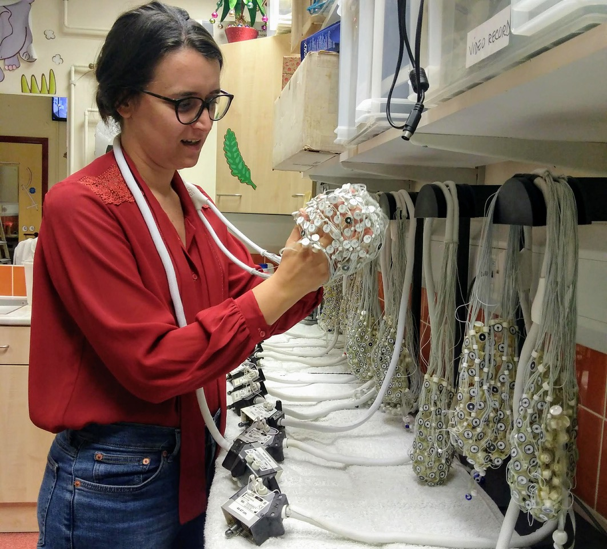

**Hello adventurer!**

This guide originated from countless email threads that I responded to during my job as postdoc coordinating remotely the collection of EEG data in other labs.

I collected my first batch of EEG data during the second year of my PhD course, aged 26, spending my first research period abroad (in Sweden). We used an EGI high density net to collect data from 5-months-old infants that were supposed to look at very tiny images of eyes on a screen.

One of my supervisors showed me how to put the net on the infant's head: he had such big hands, that all he had to do was to slightly stretch the net with cupped hands and slide them over the tiny head - he didn't even have to touch the skin. My other supervisor tried to re-assure me saying that it is certainly possible to collect excellent data from crying children.

I have tiny hands, and I am certainly not stolid, so I made lots of mistakes, had a learning curve, and eventually ended up with a very structured practice for testing.

Nowadays, I have to instruct people on how to manage to collect EEG data from tiny participants. After countless email threads and duplicated Google Documents, I decided to put everything together. With a due premise.

**These instructions and advises come from my own personal improvisation during a variety of testing sessions.**

All testing sessions are different and some degree of improvisation is always needed. I was not prepared when I entered the testing room for the first time, and only improvising different strategies has led me to accumulate the following notions. Detailed testing documents with universal rules are almost never provided - and nobody gave me one when I started testing.

I am here reporting strategies that were successful for me in studies done across the UK, Sweden, Italy and South Africa. This document is not intended to be exhaustive, nor is it possible to be exhaustive in such circumstances. There are many more strategies that I have tried that were **not** successful, and I could only gauge their efficacy through trial and error.

We as researchers must expect that children, parents and testing conditions profoundly differ between settings and there is not one rule that will work everywhere and every time. Therefore, the only real guideline is to try, fail, try again, and accumulate experience of what works and what does not, considering the context of the study and knowing your participants.

And, it is true: you can collect excellent data from crying children.

