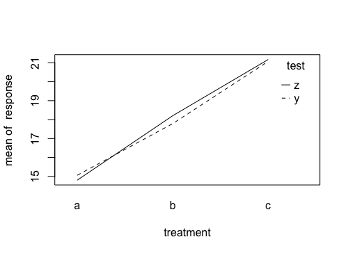

This is based on my notes of the statistics course given by [Prof. Brian Dillon](https://www.umass.edu/linguistics/member/brian-dillon) (UMass Amherst).

# Introduction

Anova is the analysis of variance based on differences among means of more than 2 samples, by comparing 2 estimates of population variance.

What are these 2 estimates of the population variance that we compare to each other with this test?

1.  The first estimate comes from the average of the variance on each group, the within-group variance. The within-group variance is determined by chance factors, usually unknown, that influence each observation unpredictably. Every kind of data in the world is affected by chance factor, no matter how precise the measurement!
2.  The second type of variance comes from the variation of means of the samples, the between-group variance, and it varies systematically with the factors of interest, such as treatment or condition.

The job of this test is to compare the within-group variance (determined by chance) and the between-group variance (determine by a factor of interest that varies between groups). The aim is to determine if the between-group variance exceeds the variance determined by chance, meaning that the variable of interest is more relevant than chance only.

## T-test is a special case of Anova, and Anova is a special case of Linear Regression

When only 2 groups are compared, the T-test and the Anova hold the same result. Both examine if the population means differ from one another, assuming equal within- and between-group variances for both. The same assumption extends to linear regression, where the residuals (data with group means subtracted) have to be equivalent. In R, the fuction 'aov' is actually a wrapper of 'lm', the function that performs linear regression!

# The One-way Anova

Let's create a dummy dataset:

```{r}
set.seed(88) #set seed for replicability of randomly generated data
treatment <- c(rep("a", 10), rep("b", 10), rep("c", 10)) #3 groups: independent variable
response <- round(rnorm(30, mean = 80, sd = 12), digits = 2) #a normally distributed dependent variable
#various steps to put IV and DV together in a dataset, and format it
df <- cbind(treatment, response) #IV and DV in columns
df<-data.frame(df) 
names(df)<-c("treatment", "response") #name the columns
df$treatment<-as.factor(df$treatment)
df$response<-as.numeric(df$response)
knitr::kable(head(df)) #preview first 6 rows
```

| treatment | response |
|:----------|---------:|
| a         |    77.28 |
| a         |    87.76 |
| a         |   108.15 |
| a         |    57.85 |
| a         |    85.52 |
| a         |    81.49 |

Let's calculate 2 estimates of the within- and between-group variances, the within- and the between-mean square, with the formulas:

1.  Within MS: Within Sum of Squares / N - G
2.  Between MS: \[N Group \* (Group Mean - Grand Mean)^2\] / G -1

```{r}
# Group Means
m1<-with(df, mean(response[treatment=="a"]))
m2<-with(df, mean(response[treatment=="b"]))
m3<-with(df, mean(response[treatment=="c"]))

# Grand Mean
GM<-(m1+m2+m3)/3

#Within Sum of Squares and Within MS
wss <- sum((df$response-GM)^2)
wms <- wss/(nrow(df)-3)

#Between MS
bms<- (with(df, length(response[treatment=="a"])) * ((m1-GM)^2) + 
      + with(df, length(response[treatment=="b"])) * (m2-GM)^2 +
      + with(df, length(response[treatment=="c"])) * (m3-GM)^2) / 3-1

#Print
cat("Within Group Variance:", round(wms, 2), "\n")
cat("Between Group Variance:", round(bms, 2))
```

> *`Within Group Variance: 152.93`*
>
> *`Between Group Variance: 162.42`*

Within the groups, observations vary by a factor of 152.93 on average, due to chance factors, such as unsystematic measurement error, individual differences and other unknown factors.

The average variance between the groups is 162.42: the statistical test will investigate if this variance attributable to treatment - a factor that systematically varies between the groups - is significantly different from the within group variance.

So 162.42 is different from 152.93, but is that enough?

# Running the Anova

The ANOVA will provide 2 useful statistics, the F Value and the p-value:

```{r, echo=TRUE}
aov<-aov(response~treatment, df)
s.aov<-broom::tidy(aov) 
knitr::kable(s.aov)
```

| term      |  df |     sumsq |   meansq | statistic |   p.value |
|:----------|----:|----------:|---------:|----------:|----------:|
| treatment |   2 |  490.2644 | 245.1322 |  1.818912 | 0.1815219 |
| Residuals |  27 | 3638.7526 | 134.7686 |        NA |        NA |

We can access further information from this output. For example, the means per group (that we calculated manually before), and the coefficients of the treatment effect (non standardized effect size), with standard error:

```{r}
m.t.means <- model.tables(aov, "mean", se=TRUE) #means
m.t.means
```

> *`Tables of means Grand mean`*
>
> *`78.38067`*
>
> *`treatment treatment a b c 78.80 83.11 73.24`*
>
> *`Standard errors for differences of means treatment`*`5.192 replic. 10`

So, the average response with treatment "a" is 78.80, with "b" it is 83.11, with "c" it is 73.24.

```{r}
m.t.eff <- model.tables(aov, "effects", se=TRUE) #coefficients
m.t.eff
```

> *`Tables of effects`*
>
> *`treatment`*`treatment a b c 0.415 4.730 -5.146`
>
> *`Standard errors of effects`*`treatment 3.671 replic. 10`

The coefficients are a measure of the effect of each treatment; they are not standardized, differently from the effect sizes that we will see below, therefore they are on the same scale of the response. We may conclude, that treatment "a" determines a variation of 0.415 points of the response, and so on. Of course, to interpret that, we need to have more information on the DV - that's when standardized effect sized may become useful (see below).

## Reporting

We can report the output table in a standard table:

```{r}
tidy.summ<-broom::tidy(aov)
knitr::kable(tidy.summ)
```

| term      |  df |     sumsq |   meansq | statistic |   p.value |
|:----------|----:|----------:|---------:|----------:|----------:|
| treatment |   2 |  490.2644 | 245.1322 |  1.818912 | 0.1815219 |
| Residuals |  27 | 3638.7526 | 134.7686 |        NA |        NA |

In the text, we can report that the IV - treatment - did not give a statistically significant difference, with F(2,27) = 1.82, p-value = 0.18.

## Effect Size

In case you find a significant effect, it is good practice to report how big/small this effect is. The coefficient, or non standardized effect size, can already give you an idea about that, but it depends on the scale of the dependent variable. It may be useful to report an effect size that is standardized, so it represents the change of the DV due to treatment in percentage.

The standardized effect size can help interpret the reliability of the p-value: if the sample size is small or highly heterogeneous, the p-value may be inflated towards significance, and give a false positive (Type I Error). Both sample size and standard deviation (a measure of heterogeneity) influence the estimate of variance, and may sum to the true effect of the IV. If that is the case, the effect size will be small, warning you that something is off with your conclusion.

The R-Squared is the best way of calculating the effect size for One-way Anova, and tells you how much of the variance is due to the effect of treatment:

```{r}
sum_squares_treatment <- tidy.summ$sumsq[1]
sum_squares_residual <- tidy.summ$sumsq[2]

R_squared <- sum_squares_treatment /
            (sum_squares_treatment + sum_squares_residual)

R_squared
```

> *`0.1187364`*

The effects size R-Squared is 0.12, so of a quite small size. If the ANOVA has given a significant treatment effect, we should be quite careful in our interpretation.

# Anova with an Interaction Effect

In the factorial analysis of variance above there are 3 groups, and the DV has been recorded in a between-subject design (i.e., the people of the 3 groups are different people). But there are no other variables! What if half of the subjects in each group was tested with a different test (y or z) for ascertaining the treatment effect?

If that is the case, it is necessary to take into account that the DV measurement in the different subjects comes from a different method. In statistical terms, it means that there may be an interaction between the IV - treatment/group - and the variable *test*.

Let's generate some data:

```{r}
set.seed(88)
subj1<-rep(1:30)
group1<-rep("a", 30)
condition<-rep(c("y", "z"), 15)
response1<-round(rnorm(30, mean = 15, sd = 0.5), digits = 2)

subj2<-rep(31:60)
group2<-rep("b", 30)
condition<-rep(c("y", "z"), 15)
response2<-round(rnorm(30, mean = 18, sd = 0.7), digits = 2)

subj3<-rep(61:90)
group3<-rep("c", 30)
condition<-rep(c("y", "z"), 15)
response3<-round(rnorm(30, mean = 21, sd = 0.9), digits = 2)

fa_1<-cbind(subj1, group1, condition, response1)
fa_2<-cbind(subj2, group2, condition, response2)
fa_3<-cbind(subj3, group3, condition, response3)

fa<-rbind(fa_1, fa_2, fa_3)
fa.df<-as.data.frame(fa)
colnames(fa.df)<-c("subj", "treatment", "test", "response")
fa.df$response<-as.character(fa.df$response)
fa.df$response<-as.numeric(fa.df$response)
knitr::kable(head(fa.df))
```

| subj | treatment | test | response |
|:-----|:----------|:-----|---------:|
| 1    | a         | y    |    14.89 |
| 2    | a         | z    |    15.32 |
| 3    | a         | y    |    16.17 |
| 4    | a         | z    |    14.08 |
| 5    | a         | y    |    15.23 |
| 6    | a         | z    |    15.06 |

To specify that 2 variables interact with each other, we use the '\*' sign in the formula. In the output, the effect of the interaction reports both effects, separate by ':':

```{r}
av<-aov(response ~ treatment*test, fa.df)
tidy.summ <- broom::tidy(av)
knitr::kable(tidy.summ)
```

| term           |  df |      sumsq |      meansq |   statistic |   p.value |
|:---------------|----:|-----------:|------------:|------------:|----------:|
| treatment      |   2 | 574.450647 | 287.2253233 | 657.6340465 | 0.0000000 |
| test           |   1 |   0.169000 |   0.1690000 |   0.3869441 | 0.5355949 |
| treatment:test |   2 |   1.719247 |   0.8596233 |   1.9682024 | 0.1460980 |
| Residuals      |  84 |  36.687467 |   0.4367556 |          NA |        NA |

According to the ANOVA result, there is a significant effect of treatment, with F(2,84) = 657.63, p-value \< 0.001, and a non-significant effect of test, with F(1,84) = 0.39, p-value = 0.54. But, the interaction between treatment and test is non-significant , meaning that the test that was used made a difference when it comes to measuring the dependent variable.

To better understand what interaction means, it is useful to visualize the means in a plot:

```{r}
with(fa.df, interaction.plot(treatment, test, response))
```



From this plot, it looks like the treatment effect is slightly overestimated in treatment A when measured with test y. However, the effect is reversed for treatment b, test y slightly underestimated it. For treatment c, the two tests seems to give the same result. Of course, if there is a systematic change of the dependent variable depending on an external factor, we need to know! That's why interaction effects can be that important.

The same considerations about effects sizes also apply to interaction effects; in this case, we may calculate the ratio between the variance (the sum of squares in the output) explained by the treatment/test/treatment\*test, and the total variance, termed eta-squared:

```{r}
ssq<-tidy.summ$sumsq

ES1<-ssq[1]/(ssq[1]+ssq[2]+ssq[3])
ES2<-ssq[2]/(ssq[1]+ssq[2]+ssq[3])
ES3<-ssq[3]/(ssq[1]+ssq[2]+ssq[3])

cat("eta-squared of treatment:", round(ES1, 3), "\n")
cat("eta-squared of test:", round(ES2, 3), "\n")
cat("eta-squared of interaction:", round(ES3, 3), "\n")
```

> *`eta-squared of treatment: 0.997`*
>
> *`eta-squared of test: 0.0003`*
>
> *`eta-squared of interaction: 0.003`*

The effect size of treatment accounts for 99.7% of the variance of the DV. The effect size of test accounts for 0.03% of the variance of the DV. The effect size of interaction accounts for 0.3% of the variance of the DV. In this case, our interpretation is in relative terms; in this case, the effect of treatment seems to only be marginally influenced by test, although the interaction is significant.

# Repeated-measures ANOVA

One of the assumptions of ANOVA is that the groups of which we are examining the means are independent. Independence is the contrary of correlation, when observations influence each other. Correlation may be relevant in some cases, for example when you measure the same response on the same group of individuals, as in within-subjects designs. Broadly speaking, the errors will be smaller because measurements come from the same people, and this could generate significant misalignment of your result.

Look at our residual variance in the previous ANOVA: it's approximately 37, but it could be bigger if we didn't account for the correlation!

The approach of ANOVA to this problem is to separate the calculations on the data in different layers - or "strata". In the background, the function ANOVA runs a separate linear regression for each of the strata.

In the formula, we need to specify the strata, for example, 1 for each subject (since the measurement is repeated a number of times for each subjects).

This process reminds of a mixed model, but it is *NOT a mixed model*. A mixed model does not run a separate linear regression for each strata, but rather allow a different estimate of each effect within a pre-defined grouping.

In this example, each participant received treatment A or B, but the response was measured with both tests y or z for each subject (within-subject design).

Let's generate the data:

```{r}
set.seed(88)
subj.r<-rep(1:30,2)
subj.r<-sort(subj.r)
treatment.r<-rep(c("a", "a", "b", "b"), 15)
test.r<-rep(c("y", "z"), 15)
response.r<-sample(round(rnorm(500, mean=8, sd=6), digits=3), 60)
rd.df<-as.data.frame(cbind(subj.r, treatment.r, test.r, response.r))
rd.df$response.r<-as.numeric(as.character(rd.df$response.r))
knitr::kable(head(rd.df))
```

| subj.r | treatment.r | test.r | response.r |
|:-------|:------------|:-------|-----------:|
| 1      | a           | y      |      3.683 |
| 1      | a           | z      |     12.882 |
| 2      | b           | y      |     10.840 |
| 2      | b           | z      |      7.350 |
| 3      | a           | y      |     15.190 |
| 3      | a           | z      |     23.827 |

```{r}
r.av<-aov(response.r ~ treatment.r*test.r + Error(subj.r), data = rd.df)
summ.tidy.rr<-broom::tidy(r.av)
summ.tidy.rr.eff<-subset(summ.tidy.rr, term!="Residuals")
summ.tidy.rr.res<-subset(summ.tidy.rr, term=="Residuals", select = -c(statistic, p.value))
knitr::kable(summ.tidy.rr)
```

| stratum | term               |  df |       sumsq |    meansq | statistic |   p.value |
|:--------|:-------------------|----:|------------:|----------:|----------:|----------:|
| subj.r  | treatment.r        |   1 |    7.264152 |  7.264152 | 0.1875885 | 0.6682496 |
| subj.r  | Residuals          |  28 | 1084.268388 | 38.723871 |        NA |        NA |
| Within  | test.r             |   1 |   21.936097 | 21.936097 | 0.8124547 | 0.3750837 |
| Within  | treatment.r:test.r |   1 |   18.859705 | 18.859705 | 0.6985134 | 0.4103593 |
| Within  | Residuals          |  28 |  755.993779 | 26.999778 |        NA |        NA |

In the output, we have 3 estimates, just as before, 2 for the effects of treatment and test, plus their reciprocal interaction.

The "stratum" (i.e., singular of "strata" - which is by the way a latin word!) indicates the level at which each of these estimates are re-calculared: at the level of each subject, and at the level of each within-subject factors (test and its interaction), that are repeated by subject:

```{r}
knitr::kable(summ.tidy.rr.eff)
```

| stratum | term               |  df |     sumsq |    meansq | statistic |   p.value |
|:--------|:-------------------|----:|----------:|----------:|----------:|----------:|
| subj.r  | treatment.r        |   1 |  7.264152 |  7.264152 | 0.1875885 | 0.6682496 |
| Within  | test.r             |   1 | 21.936097 | 21.936097 | 0.8124547 | 0.3750837 |
| Within  | treatment.r:test.r |   1 | 18.859705 | 18.859705 | 0.6985134 | 0.4103593 |

We also have two residual variances this time, the within-subject, and the within-group sum of squares:

```{r}
knitr::kable(summ.tidy.rr.res)
```

| stratum | term      |  df |     sumsq |   meansq |
|:--------|:----------|----:|----------:|---------:|
| subj.r  | Residuals |  28 | 1084.2684 | 38.72387 |
| Within  | Residuals |  28 |  755.9938 | 26.99978 |

Calculating the effect size for the repeated factor is a little different. We can calculate the percentage of variance explained by test, taking into account the variance within group, but excluding the within-subject variation (partial eta-squared):

```{r}
p.eta.test <- summ.tidy.rr.eff$sumsq[2]/(summ.tidy.rr.eff$sumsq[2]+summ.tidy.rr.res$sumsq[2])
cat("Partial eta-squared (test):", round(p.eta.test, 2))
```

> *`Partial eta-squared (test): 0.03`*

The total eta-squared uses the total sum of squares, including both within-subject and within-group variance:

```{r}
eta.test<-summ.tidy.rr.eff$sumsq[2]/(summ.tidy.rr.eff$sumsq[2]+summ.tidy.rr.res$sumsq[2]+summ.tidy.rr.res$sumsq[1])
cat("eta-squared (test):", round(eta.test, 2))
```

> *`eta-squared (test): 0.01`*

## Alternatives to RM Anova

In summary, when you have more than one measurement by subject, and you have a condition of non-independence, the approach of repeated-measures anova is *separation*, i.e., performing strata-level regressions for each unit of repetition.

This works well when the strata are balanced, for example if each subject has equal number of observations and, hence, degrees of freedom, on which the calculation of the sum of squares is based.

But if a subject has some missing observations, the whole record needs to be dropped or imputed.

When the strata are unbalanced and we risk to drop too many subjects or impute too many observations, we may decide to take another approach:

1.  a linear model that includes a correlation term between repeated measures, a relaxation of the assumption of independence, termed Marginal Model or GEE.
2.  a linear model including a new kind of effect, the random effect, that makes the model "mixed" and allows to calculate individual-level coefficients.
