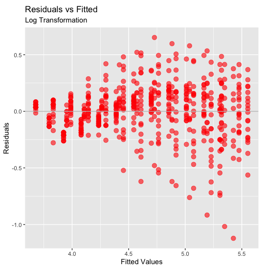
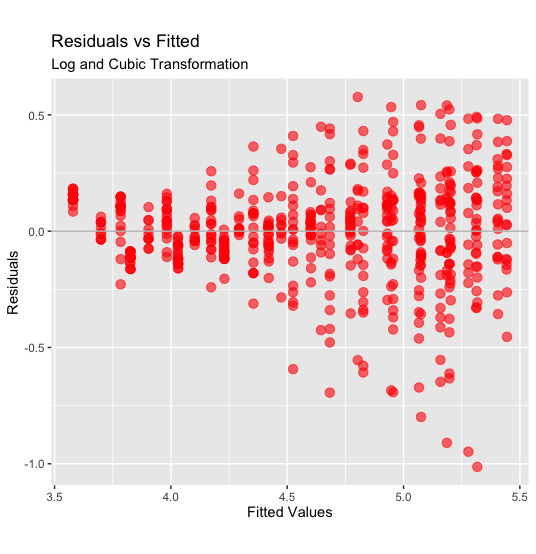

In the [previous post](https://tdbianco.netlify.app/post/the-assumptions-of-linear-regression/), we examined the relationship between a dependent variable and a couple of independent variables from the example 'Chickweight' dataset.

Upon checking of the assumptions, we found that the data did not follow a linear pattern, and residuals were heteroscedastic.

```{r}
#install.packages("ggplot2")
#install.packages("knitr")
library(ggplot2)
data("ChickWeight")
knitr::kable(head(ChickWeight))
```

| weight | Time | Chick | Diet |
|-------:|-----:|:------|:-----|
|     42 |    0 | 1     | 1    |
|     51 |    2 | 1     | 1    |
|     59 |    4 | 1     | 1    |
|     64 |    6 | 1     | 1    |
|     76 |    8 | 1     | 1    |
|     93 |   10 | 1     | 1    |

For addressing both of this problems, we can attempt a non-linear transformation of the dependent variable (Weight), and the problematic independent variable (Time)

For the heteroscedacity problem, we may choose a "concave" function, such as the logarithmic transformation.

```{r}
lrlog <- lm(log(weight) ~ Time + Diet, data = ChickWeight)

ggplot(data=ChickWeight, 
       aes(x=predict(lrlog), y=resid(lrlog))) +
  geom_point(size = 3, col = "red", alpha = 0.6) +
  geom_abline(slope = 0,
              intercept = 0,
              col = "gray") + 
  labs(x = "Fitted Values", y = "Residuals", 
       title = "Residuals vs Fitted", 
       subtitle = "Log Transformation") + 
  coord_fixed() 
```



The pattern has changed but it is still heteroscedastic; we may also attempt to transform Time to a cubic function. This can be done by using the `I` function, e.g., `I(Time^2) + I(Time^3)`. However, this method introduces a correlation between the two new terms. Therefore, we could use the function `poly`, that generates orthogonal transformations, i.e., not correlated between each other.

```{r}
lrlogcub <- lm(log(weight) ~ poly(Time,3) + Diet, data = ChickWeight)

ggplot(data=ChickWeight, 
       aes(x=predict(lrlogcub), y=resid(lrlogcub))) +
  geom_point(size = 3, col = "red", alpha = 0.6) +
  geom_abline(slope = 0,
              intercept = 0,
              col = "gray") + 
  labs(x = "Fitted Values", y = "Residuals", 
       title = "Residuals vs Fitted", 
       subtitle = "Log and Cubic Transformation") + 
  coord_fixed() 
```



Adding a cubic transformation of time seems to improve the fit. The points that lay well below the average may be outliers - that are far more visible now (although the treatmente of outliers should be pondered carefully).

Let's check if we get a similar result as before.

```{r}
knitr::kable(coef(summary(lrlogcub)))
```

|                |   Estimate | Std. Error |     t value | Pr(\>\|t\|) |
|:---------------|-----------:|-----------:|------------:|------------:|
| (Intercept)    |  4.5091139 |  0.0147902 | 304.8719977 |   0.0000000 |
| poly(Time, 3)1 | 12.5890056 |  0.2194134 |  57.3757310 |   0.0000000 |
| poly(Time, 3)2 | -1.5253665 |  0.2193305 |  -6.9546486 |   0.0000000 |
| poly(Time, 3)3 | -0.1704505 |  0.2193259 |  -0.7771562 |   0.4373885 |
| Diet2          |  0.1199428 |  0.0248970 |   4.8175605 |   0.0000019 |
| Diet3          |  0.2474644 |  0.0248970 |   9.9395248 |   0.0000000 |
| Diet4          |  0.2457223 |  0.0250289 |   9.8175523 |   0.0000000 |

The output is similar, although, since we transformed the dependent variable, all the Estimates are now on the logarithmic scale (so they can be back-transformed with `exp`). Also, we have 3 distinct Time variables, each describing a particular pattern that could be attributed to Time.

Overall, we could say that the result did not change much, as we still have a significant effect of Time and of each of the diets. Also, the extent of effectiveness of the Diets (4 is the best, 2 is the least effective) is preserved. Therefore, we could use this approach - that is a little more difficult to interpret and communicate to others - to validate our previous analysis.

## Collinearity

Another aspect that is worth checking is collinearity, or correlation, between the independent variables. If the independent variables are correlated between each other, it might introduce a bias in the regression. If that is the case, the effect of the two variables cannot be disentangled and a different approach should be taken (for example, the variables should be combined with a Factor Analysis).

Normally, one could simply plot the independent variables one against the other with the function `plot`, and calculating the correlation coefficient with `cor`.

However, in this case, it does not make much of a sense because the variable Diet is categorical. We can have a sense of the association between the two independent variables by regressing the two and looking at the correlation between the residuals and the data - as measured by the squared root of the R-Squared.

```{r}
lr_coll <- lm(Time ~ Diet, data = ChickWeight)
rsq <- summary(lr_coll)$r.squared
sqrt(rsq)
```

> `0.02882599`

The squared root of R-Squared is very small, so we may conclude that the collinearity between the two independent variable is negligible.
