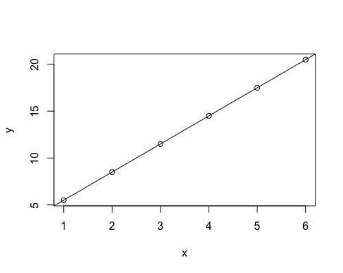
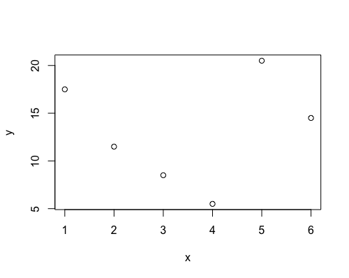
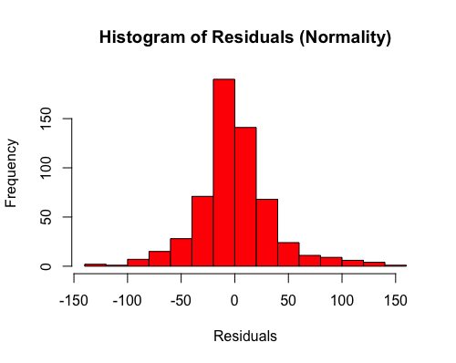
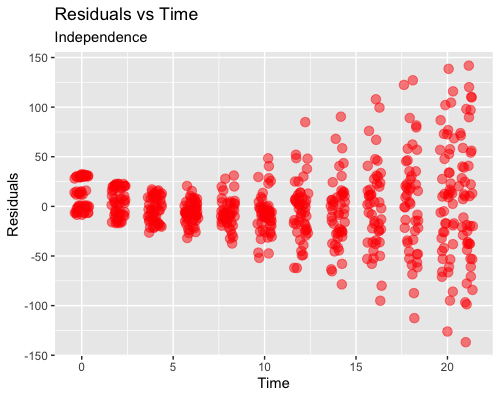
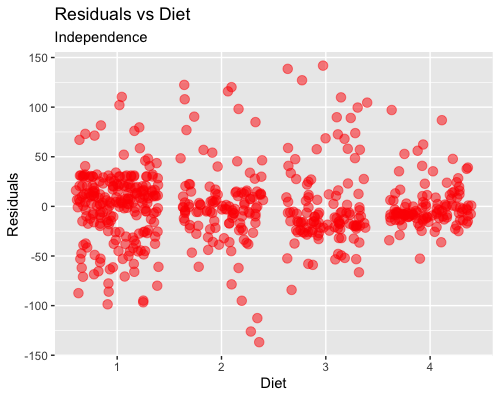
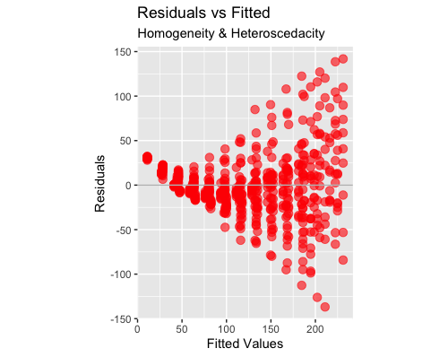

T-tests and ANOVAs are all special cases of Linear Regression. A Linear Regression is an equation defined by the essential formula of a straight line:

> `y = a + bx`

For example, these are the equations of straight lines when we put numbers instead of `a` and `b`:

> `y = 2.5 + 3x #a = 2.5 and b = 3`
>
> `y = 6.36x #a = 0 and b = 6.36`

In practical terms, these equations describe the relationship between `x` and `y`. Back in school, when we attended math class, we were given data to fill in `x` as numbers on the Cartesian `x` axes - for example, numbers between 1 and 6. Then, we needed to recognise by what factors (a - 2.5 - and b - 3 -) we needed to increase and multiply `x` to get `y`. That's how we were able to plot straight lines starting from equations:

```{r}
# install.packages("knitr")
knitr::kable(data.frame(x=1:6, 
           a=2.5,
           b=3,
           y="?"))
plot(x=1:6, y=(1:6)*3+2.5, xlab = "x", ylab = "y")
abline(a=2.5, b=3)
```

|   x |   a |   b | y   |
|----:|----:|----:|:----|
|   1 | 2.5 |   3 | ?   |
|   2 | 2.5 |   3 | ?   |
|   3 | 2.5 |   3 | ?   |
|   4 | 2.5 |   3 | ?   |
|   5 | 2.5 |   3 | ?   |
|   6 | 2.5 |   3 | ?   |



However, in research life, it is normally the other way round: it is the relationship between `y` and `x` to be unknown - in other words `a` and `b`. In any study/experiment, we collect the data to fill in `x` and `y`, and we have to derive a and b in order to investigate the relationship between y - conventionally termed the dependent variable - and `x` - conventionally termed the independent variable. That's what linear regression does: it derives a and b from `x` and `y` backward (that's what 'regress' means, right?)

```{r}
knitr::kable(data.frame(x=1:6, 
           a="?",
           b="?",
           y=(1:6)*3+2.5))
```

|   x | a   | b   |    y |
|----:|:----|:----|-----:|
|   1 | ?   | ?   |  5.5 |
|   2 | ?   | ?   |  8.5 |
|   3 | ?   | ?   | 11.5 |
|   4 | ?   | ?   | 14.5 |
|   5 | ?   | ?   | 17.5 |
|   6 | ?   | ?   | 20.5 |

# The limitations of using the equation of a straight line

Using the equation of a straight line to investigate the relationship between `x` and `y` poses a limitation: the relationship between the two variables may not be very well represented by a straight line. The first plot represented almost a perfect linear relationship, as the dots all lied on a straight line. However, most real-life data will not look like that but, most likely, something like this:

```{r}
set.seed(88)
plot(x=1:6, y=sample(x = (1:6)*3+2.5, size = 6), xlab = "x", ylab = "y")
```



Therefore, using a linear regression to derive the relationship between `x` and `y` - `a` and `b` - may led us believe that the phenomenon we are studying behaves differently - like a straight line - from what it does in reality - goes up and down. This gap between our estimate and reality is called bias: the biggest the bias, the more **useless** and misleading our regression gets. This may happen with many kind of variables: how busy a restaurant gets during the day, a person's reaction time to press a key, and the concentration of sugar in the blood at night.

## So why do we bother doing linear regression?

Linear regression is useful as long as the bias is not too big. Usefulness is justified by the fact that it is a simple method and its interpretation is straightforward; so, unless the gap/bias between the data and a straight line is excessive, the benefits of running linear regression are still higher than the drawbacks. However, there is the necessity of quantifying the extent of the bias and judge whether we are crossing the line. The way of doing is termed 'checking the assumptions': the assumptions are a series of characteristics that, if present in the data, significantly reduce the gap between the data and the straight line.

## The assumptions

1.  Normality: the deviation between the data and the `y` as estimated by the equation (i.e., the residual) must be normally distributed
2.  Independence: the residual must not be correlated to the independent variable(s)
3.  Homogeneity: dispersed data (i.e., outliers) need to be minimally present
4.  Heteroscedasticity: the variance of the residual must be constant - i.e., it must not increase/decrease with the increase/decrease of the dependent variable.

If the data break one or more of the assumptions of homogeneity, normality, independence and heteroscedasticity, then the gap/bias between the data and the equation might be excessive, and the result of the regression might be misleading.

Most of these assumptions can be checked visually - with no need of doing additional maths; however, it requires plotting (see below).

### When to check the assumptions

The proper way would be to check the assumptions as the first step of our analysis. However, this is often not practical, as in research we several independent variables, covariates and interactions, and we first have to perform a process of stepwise model selection to achieve our final equation. Therefore, I often check the assumptions as a last step, to validate my analysis.

### What then if your regression breaks the assumptions?

My personal approach is to weight the extent of the bias against a series of considerations:

1.  **Validation with another method**: non-linear methods in alternative to linear regression can be harder to interpret, and not favoured by the general public. Sometimes, I might perform the same analysis that broke the assumption of linear regression with a different method as a sort of validation. For example, if checking the assumption of normality revealed a logistic rather than a linear distribution, I will perform logistic regression and check if it gives the same result as the linear regression. If yes, I will report both - the linear regression, for sake of the reader, and the logistic regression - as a sort of 'validation'. It works as a sort of validation because it demonstrates that, despite the fact that the data breaks the linear assumptions, the bias does not influence the result (i.e., it is the same if obtained with an unbiased method).
2.  **The availability of a more useful method**: I think usefulness is a great parameter when selecting an analytic method. If analysing the data with linear regression clearly breaks most of the assumptions and you have to waste a lot of time trying to interpret a result that, with all likelihood, is not reliable, and there is a much better method that other people have used to analyse the same kind of data, then go for it. For me, this was the case of starting using Growth Curve Analysis to analyse eye-tracking data instead of linear regression.
3.  **The plausibility of my result**: if the result goes in a direction that is easily explained and was envisioned as part of the preliminary possibilities, I feel a little bit more comfortable keeping the regression as it is. If the result is absurd and inexplicable despite the design being sound and the data being balanced, it sounds more like assumptions are to blame.
4.  **The consequences of a possible error**: this is very subjective, but I think it is worth mentioning. When I am faced with broken assumptions, I ask myself what would happen if I report and publish a biased result. My reasoning include mainly 2 factors - the size of the effect, and whether there is a vulnerable group of people involved. If I find a significant result, but with a small to modest effect, I am more confident reporting that because I have some objective ground to explain that the reliability of the result might be limited, and that interpretation should be careful. If I get a big effect size, I feel more inhibited because I would not want people to jump to conclusions; I would still report the assumptions check, but in my experience most people tend to not give it much importance. Then, an perception study involving college students on favourite brands of tea will probably not influence policy, and neither will a study on the length of the index finger. However, some studies may involve persons that might be affected by the results - such as neurodiverse people, women living in protected communities, and cancer patients -; at the very least, the result could influence the way these people are seen in society. Of course this does not mean anyone is authorised to publish unreliable data in the first case, it is just my personal code for deciding when to be **extra-careful** and when **exceptionally-careful**.

There are other options too - one of the most popular the transformation of the data (for example, apply logarithmic transformation). Although it is very useful in some cases, I do not particularly like it, so I leave it to the many other online resources.

# Linear Regression of Example Dataset

Now with the practical demonstration! We will use one example dataset, the 'Chickweight', including the weight of baby birds measured across time when they are on a different diet. To produce the *diagnostic* plots, we will use ggplot - so make sure you have it installed.

```{r}
#install.packages("ggplot2")
library(ggplot2)
data("ChickWeight")
knitr::kable(head(ChickWeight))
```

| weight | Time | Chick | Diet |
|-------:|-----:|:------|:-----|
|     42 |    0 | 1     | 1    |
|     51 |    2 | 1     | 1    |
|     59 |    4 | 1     | 1    |
|     64 |    6 | 1     | 1    |
|     76 |    8 | 1     | 1    |
|     93 |   10 | 1     | 1    |

To run the linear regression on the Chickweight dataset, we have to right a formula within the simple function `lm`.

In this example, our research question is how does the baby bird's weight change across Time, and depending on different diets? Weight is our dependent variable, while Time and Diet are independent variables. We are interested in the relationship between Weight, and Time and Diet. Therefore, we build a formula starting from here:

> `y = a + bx`

with `y` = Weight, and `x` = Time + Diet. The linear regression is going to estimate a and b for us.

```{r}
lr <- lm(weight ~ Time + Diet, data = ChickWeight)
knitr::kable(coef(summary(lr)))
```

|             |  Estimate | Std. Error |   t value |   P-value |
|:------------|----------:|-----------:|----------:|----------:|
| (Intercept) | 10.924391 |  3.3606567 |  3.250672 | 0.0012189 |
| Time        |  8.750492 |  0.2218052 | 39.451248 | 0.0000000 |
| Diet2       | 16.166074 |  4.0858416 |  3.956608 | 0.0000856 |
| Diet3       | 36.499407 |  4.0858416 |  8.933143 | 0.0000000 |
| Diet4       | 30.233456 |  4.1074850 |  7.360576 | 0.0000000 |

The Estimate of Intercept is `a` - the value corresponding to the Weight baseline (10.92). The Estimate of Time is `b` - corresponding to the factor needed to increase and multiply `x` (Time 0, 2 , 6...) to get `y` (Weight). The Estimate of Diet is also `b` - the factor needed to increase and multiply `x` (Diet 2/3/4) to get `y` (Weight).

Normally, we would look at the size of `b` and the associated p-value to conclude whether Time and Diet are having a relevant effect on the baby birds' weights. Here, the Estimates of Diet are much higher than the baseline weight of the average bird (10.92), and the p-values are very significant, so we may conclude that these diets are very effective. However, we should also consider if this analysis introduces an excessive gap/bias that makes our Estimates unreliable.

## 1. Normality

The data seems to respect a normal distribution, as the most frequent values are centered around the mean (0 on the x axis of the plot).

```{r}
hist(resid(lr), 
     main = "Histogram of Residuals (Normality)", 
     xlab = "Residuals", 
     col = "red")
```



## 2. Independence

The residuals seems to depend on Time, resulting in a curved pattern, while they do not show any pattern determined by Diet. The curved pattern suggest that Weight might not change linearly across Time, but rather non-linearly, with a shape that can be approximated to a curve, rather than a straoght line.

```{r}
ggplot(data = ChickWeight, 
       aes(x = Time, 
           y = cbind(resid(lr)))) + 
  geom_jitter(size = 3, col = "red", alpha = 0.5) +
  labs(y = "Residuals", 
       title = "Residuals vs Time", subtitle = "Independence") 
```



```{r}
ggplot(data = ChickWeight, 
       aes(x = Diet, 
           y = cbind(resid(lr)))) + 
  geom_jitter(size = 3, col = "red", alpha = 0.5) +
  labs(y = "Residuals", 
       title = "Residuals vs Diet", subtitle = "Independence") 
```



## 3. Homogeneity and Heteroscedacity

From this last plot, we do see again that there is a non-liner, curved pattern in the data, that we already know is probably due to the relationship between Weight and Time (see the Weight vs Time Independence plot). While we do not spot any particularly evident outlier in this plot, so the data seems homogeneous, the assumption of Heteroscedacity is not respected, i.e., the variance of the error terms is not constant. In fact, the value of the residual increases with the increase of the response, and the data takes the typical *funnel* shape.

```{r}
ggplot(data = ChickWeight, 
                aes(x = predict(lr), 
                    y = cbind(resid(lr)))) + 
  geom_point(size = 3, col = "red", alpha = 0.6) +
  geom_abline(slope = 0,
              intercept = 0,
              col = "gray") + 
  labs(x = "Fitted Values", y = "Residuals", 
       title = "Residuals vs Fitted", 
       subtitle = "Homogeneity & Heteroscedacity") + 
  coord_fixed() 
```



## Conclusions

In conclusion, while the linear regression gave a neat picture of the effect of Time and Diet, the gap between the data and the Estimate might be just too big. In this case, one could attempt to transform the dependent variable, for example using the logarithmic transformation of Weight, and/or running a non-linear regression. We will explore these possibilities in the next tutorial.
