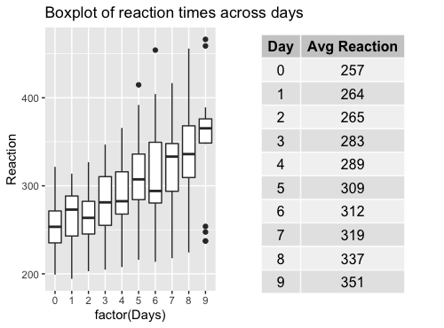

Understanding a multilevel model in R is one thing, but interpreting the output, plotting the results is another story. Let's go through all the steps of fitting and interpreting the model with some example data.

```{r, warning=FALSE, message=FALSE}
data("sleepstudy")
# install.packages("lmerTest")
# install.packages("ggplot2")
# install.packages("knitr")
library(lmerTest)
library(ggplot2)
library(knitr)
opts_template$set(figure_small = list(fig.height = 4, fig.width = 6)) 
```

As explained in [this recording](https://tdbianco.netlify.app/post/the-hitchhiker-s-guide-to-mixed-models/), this dataset comes from a study on reaction times after different days of sleep deprivation. The measurements of reaction times is repeated 9 times for each subjects, with increasing levels of sleep deprivation. Reaction is our dependent variable, that varies across days.

```{r}
kable(head(sleepstudy))
```

| Reaction | Days | Subject |
|---------:|-----:|:--------|
| 249.5600 |    0 | 308     |
| 258.7047 |    1 | 308     |
| 250.8006 |    2 | 308     |
| 321.4398 |    3 | 308     |
| 356.8519 |    4 | 308     |
| 414.6901 |    5 | 308     |

# Why a Multilevel/Mixed Model?

As it is obvious from the above table, we have several measurements for each subject taken across the week. Differently from the tests we are more used to, such as Anova, we do not calculate averages or collapse observations on a condition: the more data points per subject we have, the better. We are going to fit the model directly on this table. Let's have a look at the data:

```{r}
linep <- ggplot(data=sleepstudy, aes(y=Reaction, x=Days, color=Subject, group=Subject)) + 
  geom_point() + geom_line() +
  ggtitle("Spaghetti Plot of reaction times across days, by subject") + 
  theme(legend.position = "none") + scale_x_continuous(breaks = c(0,2,4,6,8))
linep
```


From the plot, we can make a series of observations:

1.  The first data point at day 0 is set at different heights on the y axis, corresponding to a different baseline reaction time for each subject when he/she starts the experiment. The "starting point" of each participant is usually called "intercept"

2.  Some lines, corresponding to the degree of variation of Reaction Times between days, are steeper, some are smoother, some are nearly horizontal and so on: it means that some subjects will pass from high to low reaction times quickly, some of them will only barely change, some other will remain stable overall. The degree of variation of each participant is called "slope"

These individual patterns are usually ignored by traditional tests, such as t-tests and anova, where it is necessary to collapse the dependent variable on one single level, such as:

```{r, message=FALSE}
mean.reaction <- with(sleepstudy,aggregate(Reaction,
          list(Day = Days),
          mean))
colnames(mean.reaction)[2] <- "Avg Reaction"
mean.reaction$`Avg Reaction` <- round(mean.reaction$`Avg Reaction`)
box <- ggplot(data=sleepstudy, aes(y=Reaction, x=factor(Days))) + geom_boxplot() + 
  ggtitle("Boxplot of reaction times across days") 
require(gridExtra)
g_tab2 <- tableGrob(mean.reaction, rows = NULL)
grid.arrange(box, g_tab2, ncol=2, nrow=1)
```



It looks somewhat reducing now, compared to the first plot, right? Where did all the by-subject variation go? If we stick to the traditional approach, all the variation went up into smoke!

A multilevel/mixed model is exactly letting us specifying different starting points (intercepts) and degrees of variations (slopes) for each subject. These parameters form part of the so-called **random effect**.

As every regression model, a multilevel/mixed model is specified by a formula, with a dependent/outcome/response variable (in the current example, Reaction), and some predictors (in the current example, Days). Furthermore, the model will include a specific expression (the random effect) to allow intercepts and slopes to vary by some unit of repetition (in this case, Subject and Days).

Since the random effect expresses *variation*, all the other predictors are usually called *fixed* effects or terms. In this case, the factor Days works as a fixed effect, but has both a fixed and a random term.

Let's visualize this concepts in the formula, written using the syntax of the *lmer* function in R.

# Fitting a Mixed Model in R

```{r}
m1 <- lmer(Reaction #this is the dependent variable
           ~ Days + #this is the fixed term: the effect we are mostly 
                    # interested in!
             ( 1 + Days | Subject), #This expression means: 
                                    # each Subject has their baseline RT 
                                    # (intercept) and an individual variation 
                                    # of RT between Days (slope) --> varying 
                                    # intercept and slope
           data=sleepstudy)
```

We fitted the model! We can visualize the results with the function summary:

And put it into a table:

```{r}
knitr::kable(coef(summary(m1)))
```

|             |  Estimate | Std. Error |       df |   t value | Pr(\>\|t\|) |
|:------------|----------:|-----------:|---------:|----------:|------------:|
| (Intercept) | 251.40510 |   6.824597 | 16.99973 | 36.838090 |     0.0e+00 |
| Days        |  10.46729 |   1.545790 | 16.99998 |  6.771482 |     3.3e-06 |

# Understanding the Summary Output

Even though our main focus is understanding the numerical output, the summary function reminds us that the model is linear, it has been fitted with **Restricted Maximum Likelihood method (REML)**, and degrees of freedom have been calculated with the **Satterthwaite's method**. All these parameters can be changed by an intermediate user: I will not dig any deeper here, but stick to the default formulation of the model.


**The REML criterion at convergence** corresponds to the number of iterations reached for estimating the model (not really interesting for us, not usually reported in scientific papers). The section **scaled residuals** describe the residuals, that are more relevant if the aim is predicting new values - which is not the case. So let's move on.

**The random effects** contain two parameters: Variance and Standard Deviation.

This is all what random effects are about: variation in the data. We can see here that variations between individual subjects are accounting for a big part of the variance (612), while the variation of subjects between days is smaller (35), but still noticeable. We also have the residual variation, the variance that is not explained by neither individual nor between-days variation. It is quite high here: it is partly a good sign, as it might indicate that part of the variance is indeed related to some fixed effect.

Lastly, we have the **Corr** parameter: it indicates the correlation between the random effects. In this example, the correlation between observations in different days within the same subject is infinitesimal (0.07). In case the model is too complicated (for example, with many predictors, interactions, and with converge warnings), it can be specified in the formula that the random effects are not correlated with the syntax: (1 + Days \|\| Subject).

With regard to the **fixed effects**, we have two rows, one for the intercept, and one for the fixed term, Days. Let's summarise how to interpret the fixed effects table.

## Estimate

-   A very small estimate means that the predictor has a very small effect.
-   A negative/positive estimate means that the predictor respectively decreases/increases the dependent variable.
-   The estimate is on the same scale of the dependent variable: if we are investigating the variations of neonatal heights in cm, and the predictor "mom_height" has an estimate of 2.5, it means that one unit increase of "mom_height" produces an increase of 2.5 cm of the baby's height.

In other kinds of models, such as **binomial models**, the coefficient estimate does not represent an average, but a probability.

For example, we may have fitted a binomial model for investigating the percentage of mutations of a certain gene depending on mom_age. In that case, an estimate of 2.5 for mom_age indicates the **probablity** of an infant of having a mutation depending on their mom's age. The estimate is 4 times the actual difference in percentage: in this case we have a 2.5/4=0.6\*100=60% higher probability that an infant will have a mutation for a 1 unit increase in mom_age.

## Std. Error (Standard Error)

The Std. Error is the Standard Error, or the uncertainty of the estimate. Of course we need this parameter: the estimate is an average, calculated from the individual estimates that we specified in the random effect. As all the averages, it comes with its own standard error.

Std. Error should not be bigger than the estimate, as it would indicate that the estimate is very imprecise. In general, we can calculate a confidence interval around the coefficient estimate of 2+/- Std Errors. In this example, we are pretty confident that the the estimate of the effect of Days will be no less that 10-1.5 and no more than 10+1.5.

## df (Degrees of freedom)

df are the Degrees of Freedom that, like in every statistical test, depend on the sample size (in this case, 18 total subjects).

## t value

t value is the ratio between the estimate and the std error: for Days, 10.467/1.546 = 6.77. It indicates how distant estimate is from 0 (meaning no effect of that term). As a general rule, a t-value above 2 indicates a significant result. In binomial models, this parameter is called z-value.

## Pr(\>\|t\|)

Pr(\>\|t\|) is the p-value. It has been introduced inside the *lmer* function after its first release, and some people still think that it should not be considered, but that estimates ONLY should be looked at instead. However, it is useful to include a p-value since it is the only measure that most people understand. A p-value below 0.05 indicates that the effect of the fixed effect (can be Days, or mom_height) is affecting the dependent variable above the chance level.

# Visualizing random and fixed effects

All of these parameters can be visualized in isolation from the whole summary:

1.  Random Effects:

```{r}
as.data.frame(VarCorr(m1, comp=c("Variance","Std.Dev."), digits=2))
```

| grp      | var1        | var2 |       vcov |      sdcor |
|:---------|:------------|:-----|-----------:|-----------:|
| Subject  | (Intercept) | NA   | 612.100158 | 24.7406580 |
| Subject  | Days        | NA   |  35.071714 |  5.9221377 |
| Subject  | (Intercept) | Days |   9.604409 |  0.0655512 |
| Residual | NA          | NA   | 654.940008 | 25.5917957 |

The first two rows represent the random intercept and slope, the third is the correlation between the random intercept and slope, the last row is the residual variance. The *vcov* and *sdcor* indicate the unit of each of this quantities, respectively variance and standard deviation.

2.  Fixed effects:

```{r}
knitr::kable(fixef(m1))
```

|             |         x |
|:------------|----------:|
| (Intercept) | 251.40510 |
| Days        |  10.46729 |

This *10.46729* tells us that for every variation in a unit of Days (in this case, 1), the Reaction increases of 10.5 ms on average.

The *(Intercept)* that we find together with the fixed predictor estimate is a constant, and it represents the value of Reaction when all the predictors are set to zero.

Most of the times, this *(Intercept)* does not make much sense and it is ignored: in the small example of neonatal height, the *(Intercept)* would indicate the value of a baby's height when mom_height is zero - but of course this is impossible. In the sleepstudy example, the *(Intercept)* still makes sense, since we have a day 0 before the study is started.

**But weren't we supposed to get individual intercepts and slopes for each participant?** Since the estimate ends up being a unique value and an **average**, one could ask why we even bothered with all this complexity.

The justification is the way the estimates are calculated. They are actually the average between the individual coefficients calculated by subject and by days.

But where are these individual coefficients? Just below our nose:

```{r}
knitr::kable((coef(m1)$Subject))
```

|     | (Intercept) |       Days |
|:----|------------:|-----------:|
| 308 |    253.6637 | 19.6662617 |
| 309 |    211.0064 |  1.8476053 |
| 310 |    212.4447 |  5.0184295 |
| 330 |    275.0957 |  5.6529356 |
| 331 |    273.6654 |  7.3973743 |
| 332 |    260.4447 | 10.1951090 |
| 333 |    268.2456 | 10.2436499 |
| 334 |    244.1725 | 11.5418676 |
| 335 |    251.0714 | -0.2848792 |
| 337 |    286.2956 | 19.0955511 |
| 349 |    226.1949 | 11.6407181 |
| 350 |    238.3351 | 17.0815038 |
| 351 |    255.9830 |  7.4520239 |
| 352 |    272.2688 | 14.0032871 |
| 369 |    254.6806 | 11.3395008 |
| 370 |    225.7921 | 15.2897709 |
| 371 |    252.2122 |  9.4791297 |
| 372 |    263.7197 | 11.7513080 |

The model contains individual intercepts (second column) and slopes (third column) for each of the 18 subjects (first column). Averaging the 18 *(Intercept)* and Days estimates gives exactly the *(Intercept)* and estimates given in the summary:

```{r}
# Column 1 (Intercept)
mean(coef(m1)$Subject[,1])
```

> `251.4051`

```{r}
# Column 2 (Slopes)
mean(coef(m1)$Subject[,2])
```

> `10.46729`

The same is true for the random effect, as we have subject- and day- level random effects:

```{r}
knitr::kable(ranef(m1)$Subject)
```

|     | (Intercept) |        Days |
|:----|------------:|------------:|
| 308 |   2.2585509 |   9.1989758 |
| 309 | -40.3987381 |  -8.6196806 |
| 310 | -38.9604090 |  -5.4488565 |
| 330 |  23.6906196 |  -4.8143503 |
| 331 |  22.2603126 |  -3.0699116 |
| 332 |   9.0395679 |  -0.2721770 |
| 333 |  16.8405086 |  -0.2236361 |
| 334 |  -7.2326151 |   1.0745816 |
| 335 |  -0.3336684 | -10.7521652 |
| 337 |  34.8904868 |   8.6282652 |
| 349 | -25.2102286 |   1.1734322 |
| 350 | -13.0700342 |   6.6142178 |
| 351 |   4.5778642 |  -3.0152621 |
| 352 |  20.8636782 |   3.5360011 |
| 369 |   3.2754656 |   0.8722149 |
| 370 | -25.6129993 |   4.8224850 |
| 371 |   0.8070461 |  -0.9881562 |
| 372 |  12.3145921 |   1.2840221 |

The average estimate is equal to each individual estimate minus its relative random effect. For example:

```{r}
#First Subject:
coef(m1)$Subject[1,2] - ranef(m1)$Subject[1,2]
#Second Subject:
coef(m1)$Subject[2,2] - ranef(m1)$Subject[2,2]
```

> `[1] 10.46729`
>
> `[2] 10.46729`

But what do all these estimates mean? As we introduced previously, they are estimates of the value of Reaction. Given the estimate and the random effect, we can calculate an estimated value of Reaction for each subject and each day. Each subject has a final:

> `Reaction = Intercept + Slope*x`

where x are the 1 to 9 Days in the example. For example, on Day 1, for subject 308 we have:

```{r}
253.6637 + 19.6662580*1
```

A final reaction of `273.2` ms. It is slightly different from the average estimate Reaction, calculated with the same formula but with the average intercept and slope:

```{r}
251.40510 + 10.46729*1
```

A final average of `261.8724` after day 1.

The difference between the Reaction of subject 308 at day 1, and the average Reaction at day 1 is equal to the sum of the random effects of subject 308:

```{r}
# Subtracting the average estimate from the individual estimate 
273.33 - 261.8724
```

> `11.45754`

```{r}
# summing the individual intercept and the slope random effects
2.2585647 +  9.1989720
```

> `11.45754`

They give the same result!

# Calculating and Interpreting Confidence Intervals

After we understood correctly the output of the model, we should be able to report and plot it. For mixed model, it is generally important to explain the formula that we used, and list the values of the average estimates, standard error, df, t-value and p-value. Also, confidence intervals are generally reported. Various methods exist to calculate them. A quite popular one is to use use a "bootstrap" method, that is to do the calculation with a certain number of simulations (to make the estimate more precise):

```{r, warning=FALSE, message=FALSE}
set.seed(88)  # I set the seed when the generation of new data is involved 
              # otherwise the estimate will be different every time 
ci <- confint(m1, method="boot", nsim=10)
# install.package("tibble")
ci <- tibble::rownames_to_column(data.frame(ci), "Term")
colnames(ci) <- c("Term", "CI 2.5%", "CI 97.5%")
knitr::kable(ci[5:6,])
```

| Term        |   CI 2.5% | CI 97.5% |
|:------------|----------:|---------:|
| (Intercept) | 242.44412 | 259.9099 |
| Days        |   8.70156 |  12.8210 |

The confidence intervals (CIs) of an estimate indicates that only in the 5% of cases the estimates will fall below the CI 2.5% or above the CI 97.5%. In this case, there is only a 5% chance that the intercept falls below `242.44412` and above `259.9099`.

In experiments, we need to consider two aspects of the CI:

-   Does the range between CI 2.5% and CI 97.5% contain zero? If yes, there is a high chance that the effect of the predictor might be 0, thus not effect at all.

-   How wide is the CI: an excessively wide CI means that the error of estimation is too big, and the estimate might be imprecise

-   Are the signs of the CIs discordant? Of course, if the the signs are discordant, the range contains zero. But also: our model is not capable of estimating whether our fixed predictor decreases/increases the dependent variable.

# The final step: plotting the model

Finally, we have come to plot our data and model. We will plot the data points, and the regression lines based on our average estimates:

```{r}
ggplot(data=sleepstudy, 
       aes(x=Days, y=Reaction, col=Subject, shape=Subject)) + 
  geom_jitter(size=2) + 
  theme(legend.position = "none") + 
  scale_shape_manual(values = 
                       c(15,16,17,18,19,20,21,22,23,24,15,16,17,18,19,20,21,22,23,24,25)) + 
  geom_abline(intercept = fixef(m1)[1], #Regression Line (RL).
              slope=fixef(m1)[2]) +                
  geom_abline(intercept = ci$`CI 97.5%`[5], 
              slope=ci$`CI 97.5%`[6], col="grey") + #Upper Bound of RL
  geom_abline(intercept = ci$`CI 2.5%`[5], 
              slope=ci$`CI 2.5%`[6], col="grey") +  #Lower Bound of RL
  scale_x_continuous(breaks = c(0,2,4,6,8)) +
  ggtitle("Reaction plotted on Days") +
  geom_text(aes(5, 300, label="X"), col="red", size=10) 
```


The black regression line represent the average effect of Days on Reaction. It is clearly an ascending line, with a quite steep increase, showing that Reaction is proportionally increasing of `10` each Day. In fact, if we start roughly from a baseline Reaction of 250 ms at day 0, we have a Reaction of `300` ms at Day 5 (`250 + 10*5`), as indicated by the red cross.

Of course, we can also plot all the regression lines that we have for each subject. Let's try with subject 309:

```{r, warning=FALSE}
fe <- coef(m1)$Subject
fe <- tibble::rownames_to_column(data.frame(fe),"Subject")
sub <- subset(sleepstudy, Subject=="309")
ggplot(data=sub, aes(x=Days, y=Reaction)) + 
  geom_jitter(size=2, alpha=0.5) + 
  geom_abline(intercept=fe$X.Intercept.[2],
              slope=fe$Days[2]) +
  geom_abline(intercept=fixef(m1)[1],
              slope=fixef(m1)[2], linetype="dashed") + 
  labs(title="Observations and RL of Subject 309 compared to the Avg RL", 
       caption="____ Individual Regression Line - - - - Avg Regression Line") + 
  scale_x_continuous(breaks = c(0,2,4,6,8)) +
  ylim(200,300)
```


As we can see from the plot, the regression line of Subject 309 is much less steeper than the average regression line, meaning that with Days of sleep deprivation, Subject's 309's Reaction becomes less slow than the average.

In the next demonstration, we will look at adding an interaction to this example and checking the assumptions of a mixed model.
