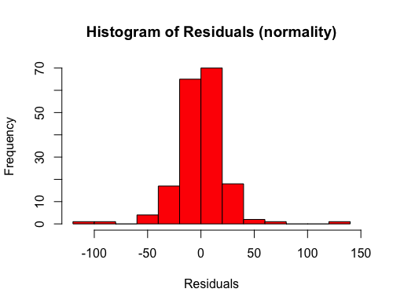

[The example we have looked at before](https://tdbianco.netlify.app/post/essential-demo-of-a-multilevel-mixed-model/) only included two variables, so we are going to add a third variable, and we are going to investigate the interaction between the independent variable (Days) and this newly generated variable (Lunch):

```{r}
data("sleepstudy")
# install.packages("lmerTest")
# install.packages("ggplot2")
# install.packages("knitr")
library(lmerTest)
library(ggplot2)
library(knitr)
opts_template$set(figure_small = list(fig.height = 4, fig.width = 6)) 
```

```{r}
set.seed(88)
lunch <- sample(c(0,1), replace=TRUE, size=18)
sleepstudy$lunch <- factor(lunch)
knitr::kable(head(sleepstudy))
```

| Reaction | Days | Subject | lunch |
|---------:|-----:|:--------|:------|
| 249.5600 |    0 | 308     | 0     |
| 258.7047 |    1 | 308     | 0     |
| 250.8006 |    2 | 308     | 1     |
| 321.4398 |    3 | 308     | 0     |
| 356.8519 |    4 | 308     | 0     |
| 414.6901 |    5 | 308     | 1     |

This variable Lunch indicates whether the participant had lunch or not before the experiment, and is specified as a factor with 2 levels (0 = no lunch, and 1 = subject had lunch).

Our revised research question would be: do the days of sleep deprivation and the fact that the participant had lunch or not, influence their reaction time? Specifically, we expect that the effects of Days and Lunch intersect with each other, so the Reaction of participants with equal days of sleep deprivation but that had lunch or not will differ. Equally, participants who both did/did not have lunch, will have different Reactions with different Days of sleep deprivation.

To specify the interaction between Day and Lunch in the formula. we use the syntax:

```{r}
m2 <- lmer(Reaction 
           ~ Days * lunch + 
             ( 1 + Days | Subject), 
           data=sleepstudy)
knitr::kable(coef(summary(m2)))
```

|             |    Estimate | Std. Error |        df |    t value | Pr(\>\|t\|) |
|:------------|------------:|-----------:|----------:|-----------:|------------:|
| (Intercept) | 250.3941456 |   7.420106 |  22.88696 | 33.7453612 |   0.0000000 |
| Days        |  10.7097735 |   1.647984 |  21.73804 |  6.4987117 |   0.0000016 |
| lunch1      |   2.7242730 |   7.809677 | 153.94663 |  0.3488330 |   0.7276913 |
| Days:lunch1 |  -0.6216404 |   1.463213 | 153.67334 | -0.4248461 |   0.6715431 |

Since Lunch is a binary variable, the output lunch1 indicates the estimate of the effect of having had lunch before the experiment. To run the formula the other way around, we could use the function `factor` to re-order the levels of the variable, and put *1* first. Then, we would get `lunch0` in the output. However, it would still give the same estimate, just with the opposite sign (so, `-2.72`).

Please note, the p-values of Lunch and the interaction are non-significant - after all, the variable Lunch is generated randomly. But we will have a deeper look anyway to understand how interaction works.

So, according to this output, having had lunch increases/slows down Reaction of 2.72 ms. However, this effect is downgraded by Days, as demonstrated by the negative estimate of the interaction term, Days:lunch1, in other words, while Days are accumulating, the effect of Lunch becomes smaller.

The interaction term could also be interpreted the other way around, with a focus on Days: the difference between Days is lower for those Subjects that had lunch (where lunch==1).

In the specific case, the participant with lunch will start with a little higher Reaction compared to fast subject (because we add 5.92 to the starting point - the intercept); however, the final Reaction at Day 9 will be a little bit less (because every day we are subtracting 1.38).

By doing the calculation, the average Reaction for participants who had lunch on Day 1 will be:

```{r}
(250.39 + 2.72) + (10.70 - 0.62)*1
```

> 263.19

while the average reaction when lunch was 0 is simply:

```{r}
(250.39) + (10.70)*1
```

> 261.09

On Day 9, the situation is different. For subjects who had lunch:

```{r}
(250.39 + 2.72) + (10.70 - 0.62)*9
```

> 343.83

while the average reaction at Day 9 when they had no lunch was:

```{r}
(250.39) + (10.70)*9
```

> `346.69`

[As we illustrated before](https://tdbianco.netlify.app/post/anova-purpose-and-practice/), a very handful way of understanding interactions is plotting them.

```{r}
ggplot(data=sleepstudy, 
       aes(x=Days, y=Reaction, col=lunch)) + 
  geom_jitter() + 
  geom_abline(intercept = 250.39 + 2.72, slope = 10.70 - 0.62, 
              linetype="dashed") + 
  geom_abline(intercept = 250.39, slope = 10.70) +
  labs(title="Model with interaction Days:lunch", 
       caption="___ No Lunch \n - - - With Lunch") + 
  scale_x_continuous(breaks = c(0,2,4,6,8))
```


As shown from the output, participants who got lunch seem a little bit slower at the start, but they remain a little bit faster at the end. Of course, the difference is very small, hence the non significant result!

# Diagnostic plots

Ad for linear regression, a necessary step to ensure that the analysis fits the data correctly is to check that [assumptions are respected](https://tdbianco.netlify.app/post/the-assumptions-of-linear-regression/).

The **QQNorm** plot shows predicted and sample data extracted from the observed values (i.e., quantiles), and aims to demonstrate that the data fits the normal distribution:

```{r}
qqnorm(resid(m1)) ; qqline(resid(m2), col="red")
```


Although some extreme observations seem to deviate from the normal distribution, the rest of the values seem to lie on the line okay.

**The Residual Plot** focuses on residuals, "the difference between the observed value and the estimated value of the quantity of interest (for example, a sample mean)"[^1]. In the case of a regression, residuals represent the distance between the dependent variable (Reaction), and its estimates worked out by the regression function (the so-called *fitted* values). Plotting the residuals can demonstrate that various important assumptions are respected:

[^1]: <https://en.wikipedia.org/wiki/Errors_and_residuals>

1.  **Homogeneity**: data points should not be dispersed. We might spot some outliers.

    ```{r}
    ggplot(data = sleepstudy, aes(x = predict(m2), y = cbind(resid(m2)))) + 
      geom_point(size = 3, col = "red", alpha = 0.6) +
      geom_abline(slope = 0,
                  intercept = 0,
                  col = "gray") + 
      labs(x = "Fitted Values", y = "Residuals", 
           title = "Residuals vs Fitted", 
           subtitle = "Homogeneity") + 
      coord_fixed() 
    ```

    

2.  **Normality**: see the shape, is it normally distributed?

    ```{r}
    hist(resid(m2), main = "Histogram of Residuals (normality)", 
         xlab = "Residuals", col = "red")
    ```

    

3.  **Independence**: finally, plotting the residuals vs the independent variables

```{r}
ggplot(data = sleepstudy, aes(x = Days, y = cbind(resid(m2)))) +    geom_jitter(size = 3, col = "red", alpha = 0.5) +   
  labs(y = "Residuals", title = "Residuals vs Days", 
       subtitle = "Independence") +    
  scale_x_continuous(breaks = c(0,2,4,6,8))

```


```{r}
ggplot(data = sleepstudy, aes(x = lunch, y = cbind(resid(m2)))) + 
  geom_jitter(size = 3, col = "red", alpha = 0.6) +
  labs(y = "Residuals", 
       title = "Residuals vs Lunch", 
       subtitle = "Independence") 
```


From these plots, we could infer that there is some problem with outliers, in particular for some of the participants in the Lunch = 1 group.
