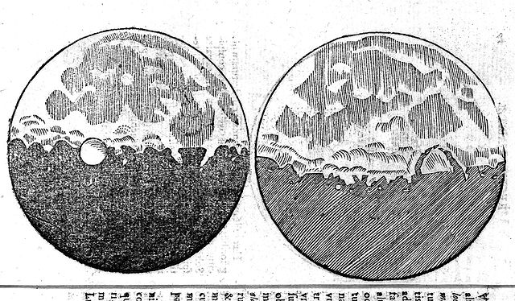
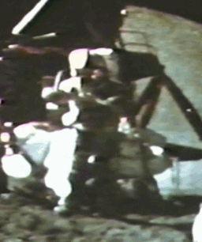

*Note: this post is an adaptation of a lesson that my dad, Enrico, recorded and posted on YouTube for his high school students during the first Covid lockdown. I have yet to listen to a better explanation of the scientific method, and I always felt that such clarity should reach a wider audience. Therefore, I translated the recording and adapted it into the post below. The original recording in Italian is linked [here](https://youtu.be/mdYdjPKtqKI). Thanks dad!*

**It is often assumed that [Galileo Galilei](https://en.wikipedia.org/wiki/Galileo_Galilei) theorised the so-called *scientific method* for the first time -- the same method we scientists use today -- consisting of building an hypothesis and testing it under pre-specified conditions.** However, Galileo has never written a single word on said method. He had little sympathy for rules -- differently from his famous contemporaries such as the English Francis Bacon, who wrote an entire manuscript -- the Novum Organum - dissecting scientific rules, and his renowned successors, René Descartes (known as Cartesius), who wrote a dedicated essay on the method, and Isaac Newton, who pondered the method and the rules of philosophizing - which are the rules of scientific research - in his great work of physics Philosophiæ Naturalis Principia Mathematica. Galileo did not dictate a standardised method, and most certainly did not write a book about it. He rather reserved his best supply of perplexity for standardised methods -- so much that one might think that his genius and fruitful research resided in the absence of a standardized method.

**Surely, Galileo followed indications and methodological requirements, but he was never rigid about them. In his own work, he based scientific research on two pillars: the inductive and the deductive approach.** The inductive pillar ascends, so to speak, from the observation of specific cases to a general theory formalised in mathematical terms. The deductive pillar instead descends from the universal theories to derive implications for the scientist to verify empirically. And while Galileo identified these two moments, he did not expect that they operated in the same way in every area of research. **For instance, when he was lifting his telescope to the sky and elaborating astronomical observations, the inductive pillar was very robust.** From what he saw of the moon, the planets, the sunspots, and his transcriptions of the parallax of the stars, he found support for the Heliocentric theory - that the sun stands at the center of the Solar System, and the Hearth and the other planets orbits around it. From there, he deduced further consequences: if the sun stands at the center of the Solar System, other characteristics that had not yet verified arised, and the astronomer's work continued -- building up the full picture of the Solar System step by step. Surely this works for astronomy -- building an idea from cases and observation, and deducing experimental consequences.

*Galileo observed shadows and spots on the Moon's surface and realised they were shadows of mountains and craters, fact that implied that Moon and Earth were more similar than predicted according to dominant views that put Earth and humans at the center of the Universe.*

**In the field of physics, however, this is not quite the case.** In his peculiar treaty, the "Dialogue Concerning the Two Chief World Systems" -- where he makes three fictional characters debate the foundations of common sense, current and his revolutionary ideas - he exposes a "mental experiment" to take place on "a great ship". To demonstrate his point, Galileo imagines impossible conditions -- such as a ship that would proceed with constant speed without any friction. Despite being unrealistic, the example served the purpose of illustrating and testing his logic, and ended up being considered the first intuition of the principle of relativity. Clearly in this case, theory precedes observation: the scientist builds the case and applies ideal conditions, notwithstanding plausibility. **From this ideal setting, Galileo -- and scientists in general -- imagines consequences to verify experimentally in the real world eventually.** Thus, in contrast to astronomy, physics has a weaker inductive element: it is the theory that precedes experience.

*Astronauts on the moon proved that, in the absence of atmosphere, a feather and a hammer would fall at the same speed. In this case, Galileo's theory has preceded observation of almost 400 years!*

**It is clear now that Galileo's method is the absence of a standardized method: the rule is to adapt methodological requirements - observation, theoretical hypothesis, experimental verification - to obtain results depending on the situation, such as observing a planet, or working with pendulums and weights.** For pendulum and weights, observation may not be as valid as in astronomy -- after all, a weight falling over a ramp is only a poor substitute of more complex bodies - and imagination needs to intervene to build a phenomenon. Eventually, this is the fundamental element of Galileo's epistemology: for certain phenomena, only an artificial reproduction can be the object of scientific study. Scientists need to build this reproduction with their creative, scientific imagination. This is Galileo's - and our own - concept of experiment: scientists do not walk the world trying to experience a phenomenon themselves to prove their theory. **Galileo built mental and real experiments to be carried out in the laboratory -- as most of us do -- and the key word here is "built".** Modern science is not a passive discipline that records ambiguous events as they occur, it builds the event to be studied, and it does so by using what Galileo believed to be the very language of nature, mathematics. Natural phenomena and their artificial stunts are written in mathematical terms, and human minds understands them because they also work by mathematical rules. Hence, scientific experience is separate from everyday experience, but talks the same language.

**If Galileo was an empiricist, he is very different from every other empiricist, such as Aristotle and Thomas Aquinas, William of Ockham and Francis Bacon, John Locke and David Hume.** Galileo attributes a fundamental role to creativity - scientific creativity that non arbitrarily writes a phenomenon in mathematical language, the same language of Nature, and designs experiments to support its claims. Philosopher Immanuel Kant, the major eighteenth-century interpreter of Galileo, said that when human beings study nature, they cannot ignore what they are, their own nature which is not passive but, as Galileo believed, creative.

*Finding references is above me, after all this is just a blog post, but [here](https://plato.stanford.edu/entries/galileo/), [here](http://galileo.rice.edu/) and [here](https://www.jstor.org/stable/231825) are some interesting resources. And, if you ever visit Florence, remember to go and check Galileo's middle finger on display at the Science Museum. I find it is the most appropriate relics.*
