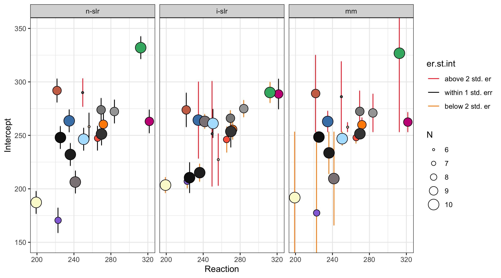
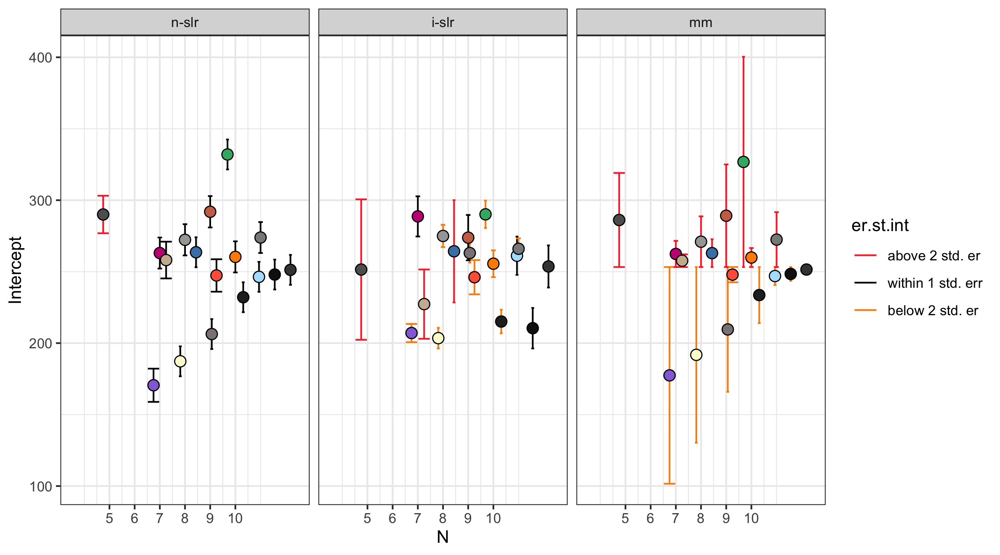
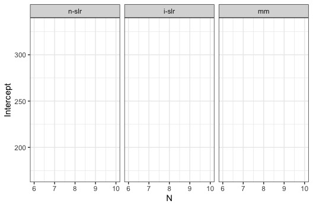

At one of my first lab meetings as a postdoc, I started advertising multilevel/mixed models to my colleagues to convince them to give up multiple testing. On that occasion, my supervisor struck me with the question:

> Why should we do a mixed models when we can run a separate regression for each subject?

My first untold answer - written on my face - was: why would you run a separate regression for each subject?

But I soon understood that skepticism does not promote change, so I engineered a comparison between mixed model and standard linear regression that allowed the visual inspection of the difference between the two.

I obtained two plots that I love very much and that nobody in my lab has really cared about or understood since then (very sadly, they always get skimmed off paper drafts).

But making them was epic nonetheless. Ladies and gentlemen, here you have


# Method

As I could not be satisfied with a twofold comparison, I fitted 3 linear regressions:

-   **Non-pooled standard linear repression** (N-SLR): if one wants to obtain individual coefficients (as the mixed model does) from a standard linear regression, this is the most straight-forward way of doing it. I entered subject as predictor, and I excluded the intercept from the equation

-   **Individual standard linear repression** (O-SLR): this is the one my supervisor suggested. Thanks to a `for loop` (may tge Gods of real programmers forgive me), I run as many regressions as the number of subjects. Each regression includes one individual subject's data only

-   **Multilevel/mixed model** (MM): I entered subject in the random effect

I am going to use the `sleepstudy` dataset, and excluding some observations at random, thus leaving a number of subjects an incomplete record. This is a typical situation where mixed modelling is recommended for handling missing data more robustly.

The way it does that is to weight each subject's individual coefficient by the number of observations when calculating the average coefficient - assuming that a the individual coefficients of a subject with missing data will be less reliable. This sounds clear enough, however, when I provide this explanation in real life, this is what most people hear:


That's why we are going on with this demonstration.

# The Example

I am going to use the continuous variable Days as unique predictor; its coefficient represents the standardized effect size of the effect of Time; its standard error represents the precision of the coefficient.

For each regression type, the coefficient and the standard error correspond to:

-   **N/I-SLR and I-SLR**: the intercept corresponds to the individual coefficient. The standard error corresponds to the square root of the sample variance, or mean squared error (MSE).

-   **MM**: the sum of the fixed and random effect corresponds to the individual coefficient. The standard error corresponds to the joint MSE of the variances of the fixed and the random effect.

## Adding missing values to the dataset

```{r}
# install.packages(c("lme4", "dplyr", "knitr", "ggplot2"))
library(lme4) #initialise the libraries containing the functions that we need
library(dplyr)

data("sleepstudy") # initialise the dataset

set.seed(7) #setting the seed to we sample the same row numbers
missing <- sample_n(sleepstudy, 18, weight = Reaction) %>%
  arrange(Subject)
sleepstudy <- sleepstudy %>%
  anti_join(missing, by = c("Reaction", "Days", "Subject"))
knitr::kable(head(sleepstudy))
```

| Reaction | Days | Subject |
|---------:|-----:|:--------|
| 249.5600 |    0 | 308     |
| 250.8006 |    2 | 308     |
| 356.8519 |    4 | 308     |
| 414.6901 |    5 | 308     |
| 290.1486 |    7 | 308     |
| 430.5853 |    8 | 308     |

As shown above, some of the data is missing (for subject 308, Day 1, 3 and 6 are missing).

# N-SLR

First, we run the standard linear regression, assuming Subject as predictor.

```{r}
lm_nslr <-lm(Reaction ~ Days + Subject - 1, data=sleepstudy)
coef <- summary(lm_nslr)$coefficients
coef.lm_nslr <- rbind(data.frame(Subject=gsub(pattern="Subject", 
                                              replacement="",
                                              x=rownames(coef[-1,])), 
                           Intercept=coef[-1,1],
                           St.er.int=coef[-1,2],
                           Method="n-slr"))
rownames(coef.lm_nslr) <- NULL
knitr::kable(head(coef.lm_nslr))
```

| Subject | Intercept | St.er.int | Method |
|:--------|----------:|----------:|:-------|
| 308     |  290.0047 |  13.10764 | n-slr  |
| 309     |  170.5242 |  11.62282 | n-slr  |
| 310     |  187.2806 |  10.47325 | n-slr  |
| 330     |  263.0426 |  10.85180 | n-slr  |
| 331     |  263.2829 |  11.12269 | n-slr  |
| 332     |  263.5814 |  10.47325 | n-slr  |

And obtain individual coefficients and standard errors for each subject.

# I-SLR

Then, we iteratively subset the dataset inside a `for loop` to run individual linear regressions for each of them.

```{r}
coef.lm_islr <- data.frame()
ids <- unique(sleepstudy$Subject)
for (i in 1:length(ids)) 
{
  d.s = subset(sleepstudy, Subject==ids[i])
  if (is.nan(mean(d.s$Days, na.rm=T))) 
  {
    coef.lm_islr = rbind(coef.lm_islr, data.frame(Subject=(ids[i]), 
    Intercept=NA, St.er.int=NA, Method="i-slr"))
  }
  else
  {
    lm_islr = lm(Reaction ~ Days, data=d.s)
   coef = summary(lm_islr)$coefficients
    coef.lm_islr = rbind(coef.lm_islr, data.frame(Subject=(ids[i]),
    Intercept=coef[1,1], St.er.int=coef[1,2], Method="i-slr"))
  }
}
knitr::kable(head(coef.lm_islr))
```

| Subject | Intercept | St.er.int | Method |
|:--------|----------:|----------:|:-------|
| 308     |  251.4847 | 49.133461 | i-slr  |
| 309     |  207.0660 |  6.378284 | i-slr  |
| 310     |  203.4842 |  7.241315 | i-slr  |
| 330     |  288.6689 | 14.061765 | i-slr  |
| 331     |  284.7526 | 18.185512 | i-slr  |
| 332     |  264.2516 | 35.792017 | i-slr  |

Just as above, we obtain individual coefficients and standard errors for each subject.

# Mixed Model

When running a mixed model, we do not need to trick the formula but simply add subject as random effect, and extract the individual coefficients.

```{r}
lm_mm <- lmer(Reaction ~ Days + (1|Subject), data=sleepstudy)
coef <- coef(lm_mm)$Subject$'(Intercept)'
err <- ranef(lm_mm)$Subject$'(Intercept)'
coef.mm <- rbind(data.frame(Subject=rownames(coef(lm_mm)$Subject),
Intercept=coef, St.er.int=err, Method="mm"))
knitr::kable(head(coef.mm))
```

| Subject | Intercept |  St.er.int | Method |
|:--------|----------:|-----------:|:-------|
| 308     |  286.1487 |  32.914509 | mm     |
| 309     |  177.4405 | -75.793661 | mm     |
| 310     |  191.7955 | -61.438648 | mm     |
| 330     |  262.3964 |   9.162275 | mm     |
| 331     |  262.6362 |   9.402012 | mm     |
| 332     |  262.9750 |   9.740829 | mm     |

Lastly, we combine the three sets of individual coefficients, each calculated with a different method, into the same dataset.

```{r}
all_coef <- rbind(coef.lm_nslr, coef.lm_islr, coef.mm)
```

# Plotting the Individual Coefficients

To get a grasp of the reliability of the 3 sets of individual coefficients, we are going to plot them against the real values, the actual measurements of Reaction. For this example, we are going to only focus on the Intercept, so we are plotting it against the baseline Reaction at Day 0 (of whom the Intercept is an estimate).

```{r}
bs_data <- sleepstudy %>%
  filter(Days==0) %>%
  left_join(all_coef, by="Subject") 
```

```{r}
gp_data <- sleepstudy %>%
  group_by(Subject) %>%
  summarise(N=n())
```

```{r}
m.er.int <- all_coef %>%
  group_by(Method) %>%
  summarise(m.er.int=mean(St.er.int))
```

```{r}
bs_data_p <- bs_data %>%
  left_join(gp_data, by="Subject") %>%
  left_join(m.er.int, by="Method") %>%
  mutate(er.st.int=ifelse(St.er.int>1.9+m.er.int, "above 2 std. er",
                          ifelse(St.er.int>m.er.int & St.er.int<1.9+m.er.int, "within 1 std. err", 
                                 ifelse(St.er.int<m.er.int & St.er.int>-1.9+m.er.int, "within 1 std. err",
                                        ifelse(St.er.int<-1.9+m.er.int, "below 2 std. er",))))) %>%
  mutate(er.st.int=factor(er.st.int, levels = c("above 2 std. er", "within 1 std. err", "below 2 std. er"))) %>%
  mutate(Method=factor(Method, levels = c("n-slr", "i-slr", "mm")))
knitr::kable(head(bs_data_p))
```

| Reaction | Days | Subject | Intercept |  St.er.int | Method |   N | m.er.int | er.st.int         |
|---------:|-----:|:--------|----------:|-----------:|:-------|----:|---------:|:------------------|
| 249.5600 |    0 | 308     |  290.0047 |  13.107638 | n-slr  |   6 | 11.01682 | within 1 std. err |
| 249.5600 |    0 | 308     |  251.4847 |  49.133461 | i-slr  |   6 | 15.23288 | above 2 std. er   |
| 249.5600 |    0 | 308     |  286.1487 |  32.914509 | mm     |   6 |  0.00000 | above 2 std. er   |
| 222.7339 |    0 | 309     |  170.5242 |  11.622820 | n-slr  |   8 | 11.01682 | within 1 std. err |
| 222.7339 |    0 | 309     |  207.0660 |   6.378284 | i-slr  |   8 | 15.23288 | within 1 std. err |
| 222.7339 |    0 | 309     |  177.4405 | -75.793661 | mm     |   8 |  0.00000 | below 2 std. er   |

The plots below present the individual coefficients as individual points; the error bars represent the standard errors. At a glance, the 3 flaking plots illustrate the core difference between standard regression and mixed models.

In non-pooled standard regression, despite the fact that there are individual coefficients, the standard errors are very close to each other, and do not vary based on, say, the number of available observations.

In the individual standard regressions, we have 3 Subjects that stand out because their error is above 2 standard errors from the mean error. The second plot shows that there is correlation between number of observations and magnitude of the error. However, in this case, the standard error is a measure of precision of the measurement of one Subject compared to the same Subject, and not the entire sample, so we cannot be sure if this is due to missing values or that Subject performing in a very disparate way.

In the case of the mixed model, all the observations are marked at different levels, meaning that all the observations are going to assume a different weight when calculating the fixed effects. A couple get a very long bar even thought they did not from the individual standard regressions, meaning that their performance might be consistent withing that subject, but highly atypical when taking into account everybody else.

```{r}
library(RColorBrewer) #preparing filling colours
set.seed(7)
n <- length(unique(sleepstudy$Subject))
fill <- grDevices::colors()
fill1 <- sample(fill, n)
```

## Plotting on the mean

```{r, message=FALSE, error=FALSE}
library(ggplot2)

ggplot(data=(bs_data_p),
       aes(x=Reaction, y=Intercept, 
           fill=Subject)) +
  facet_grid(~Method) +
  
  geom_errorbar(aes(x=Reaction,
                    ymin=Intercept-St.er.int,
                    ymax=Intercept+St.er.int,
                    col=er.st.int),
                position=position_dodge(2)) +
  
  geom_jitter(aes(size=N), shape=21) +
  
  scale_radius() +

  scale_fill_manual(values=fill1) + 
  
  scale_color_manual(values=c("firebrick1", "black", "darkorange")) +
  
  guides(fill = "none") +
  
  coord_cartesian(ylim=c(150, 350)) +
  
  theme_bw()
```



## On N

```{r}
ggplot(bs_data_p,
       aes(x=N, y=Intercept, 
           fill=Subject)) +
  
  geom_errorbar(position=position_dodge(5),
                aes(ymin=Intercept-St.er.int,
                    ymax=Intercept+St.er.int,
                    col=er.st.int, group=Subject)) +
  
  geom_point(size=3, position=position_dodge(5), shape=21) +
  
  guides(fill = "none") +
  
  scale_fill_manual(values = fill1) +
  
  scale_color_manual(values=c("firebrick1", "black", "darkorange")) +
  
  scale_x_continuous(breaks = c(5:10)) +
  
  facet_wrap(~Method) +
  
  theme_bw() 
```



If we consider the intercept from each regression:

```{r}
knitr::kable(rbind(`n-slr`=mean(lm_nslr$coef[-1]),
`i-slr`=mean(coef.lm_islr$Intercept),
`mm`=mean(coef.mm$Intercept)))
```

|       |          |
|:------|---------:|
| n-slr | 253.2050 |
| i-slr | 252.0537 |
| mm    | 253.2341 |

In this (artificial) example, the difference is small. However, we may observe that both the non-pooled (n-slr) and individual (i-slr) regressions are underestimating the intercept. This may be due to standard errors below the average error being absent or small in n-slr and i-slr, as shown by the plots. In a real-life scenario, this might lead to believe that Subjects had faster reactions on average at the beginning of the experiment - thus influencing the estimate of how much slower they become in the course of the experiment. The mixed model would instead weight down the faster Subject, proportionally to how many observations are available.

I hope that this post might serve as an inspiration to others, and that when you see these plots this is not what you will see:


