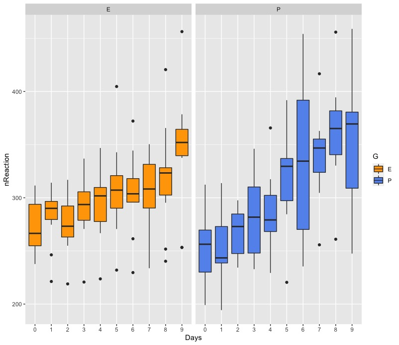
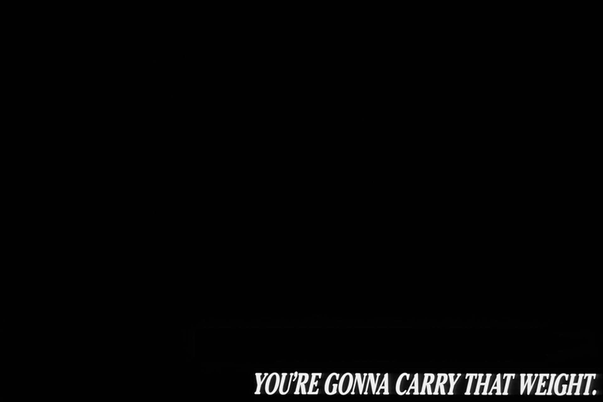

Often, when implementing statistical analysis we ignore variability, and focus on systematic effects of independent variables. This is possible because we assume that variability occurs at random and equally across variables, stimuli , participants, and time points - that it is **homogeneous**.

However, variability **can** vary systematically, and therefore vary between variables, conditions and participants - thus being **heterogeneous**. Ignoring it may lead to confound the effects of independent variables. To take variability into account, it needs to *enter* our models. The way of doing it is to add the **structure of the variance** of the random effects as an additional variable in the model, and specify its structure. It is difficult to guess the structure taken by the variance, so it is useful to treat it as an hypothesis itself, and compare models with different variance structure.

```{r}
# install.packages("dplyr")
# install.packages("ggplot2")
# install.packages("lme4")
# install.packages("nlme")
# install.packages("knitr")
# Load packages
packs <- c("dplyr", "ggplot2", "lme4", "nlme", "knitr")
lapply(packs, require, character.only = TRUE)
# Load data
data("sleepstudy")
```

This is the data as we already have visualised it [before](https://tdbianco.netlify.app/post/essential-demo-of-a-multilevel-mixed-model/):

```{r}
kable(head(sleepstudy))
```

| Reaction | Days | Subject |
|---------:|-----:|:--------|
| 249.5600 |    0 | 308     |
| 258.7047 |    1 | 308     |
| 250.8006 |    2 | 308     |
| 321.4398 |    3 | 308     |
| 356.8519 |    4 | 308     |
| 414.6901 |    5 | 308     |

To use this dataset for the current example, we are going to 1) add a categorical variable generated at random 2) shift values of the DV pertaining to 1 group towards the sample mean.

```{r}
#generate categorical variable 'G'
set.seed(88)

sg <- data.frame()
sb <- unique(sleepstudy$Subject)

for (i in 1:length(sb)) {
  g = sample(LETTERS[c(5,16)], size = 1)
  sg = rbind(sg, cbind(Subject=paste(sb[i]), G=g))
}
sleepstudy <- inner_join(sleepstudy, sg, by="Subject")
```

```{r}
#shift group E towards sample mean
m <- mean(sleepstudy$Reaction)
set.seed(88)
sleepstudy <- sleepstudy %>%
mutate(diff=Reaction-m,
ndiff=ifelse(G=="E" & diff<0, diff+sample(10:20,1), ifelse(G=="E" & diff>0, diff-sample(5:15,1), diff)),
nReaction=ndiff+m,
Days=as.factor(Days))
```

Now let's plot the data and examine the variance visually.

```{r}
sleepstudy %>%
  ggplot(aes(y=nReaction, x=Days, fill=G)) +
  geom_boxplot() +
  facet_wrap(~G) +
  scale_fill_manual(values = c("orange", "cornflowerblue"))
```



The length of the boxes and whiskers of the box plots indicate that variance is smaller in group E, compared to group P. Therefore, there is evidence that variance is not randomly and equally distributed between groups, but it varies systematically with one of the variables, group G. We are going to try out modelling this data assuming homogeneous and heterogeneous variance.

# Variance homogeneity model

To explicitly model variance in the model, we are going to use the function `lme` from the package `nlme`.

This model assumes common variance between and within observations, irrespective of the variable G. This is the default model fit by `lme` with the standard specification of the random effect with 1 grouping variable - that we will run without fixed effects:

```{r}
# Common models for between and within variance
model.hv = lme(fixed = nReaction ~ 1,  
               random = ~ 1 | Subject,
               data = sleepstudy,
               method = 'REML')
summary(model.hv)
```


```{r}
VarCorr(model.hv)[1]
```

> `[1] "1055.917"`

`1055.917` is the shared variance across the 2 groups due to between-participants differences. This, summed to the residual variance:

```{r}
VarCorr(model.hv)[2]
```

> `[1] "1602.661"`

gives the total variance.

By extracting the Variance-Covariance Matrix, we visualise the total variance on the diagonal, and the common covariance off-diagonal:

```{r}
getVarCov(model.hv, type="marginal", individuals = 1) 
```


The Variance-Covariance structure is the same for all subjects:

```{r}
getVarCov(model.hv, type="marginal", individuals = 15) 
```


The variance attributed to participant is a measure of the intraclass correlation and can be converted to a correlation coefficient when divided by the total variance:

```{r}
as.numeric(VarCorr(model.hv)[1])/(as.numeric(VarCorr(model.hv)[1])+as.numeric(VarCorr(model.hv)[2]))
```

> `0.3971736`

This kind of variance structure is also termed *compound symmetry*. The model assigns this structure by default, however, this can be explicitly specified in the random effect:

```{r}
model.cs = lme(fixed = nReaction ~ 1,  
               random = list(Subject = pdSymm(form = ~ 1)),
               data = sleepstudy,
               method = 'REML')
```

This gives the same result with between-subject Variance:

```{r}
VarCorr(model.cs)[1]
```

> `[1] "1055.917"`

pdSymm creates a positive-definite Symmetric matrix:

```{r}
pdSymm(diag(rep(x = 1, times = 3)), nam = c("A","B","C"))
```


## What about `lmer`?

In the default model fit of `lmer`, the variance is left *unstructured*, thus adapting to the variability in the data, and not taking any assumptions ("*lme4 uses general-purpose nonlinear optimizers (...) to estimate the variance-covariance matrices of the random effects*"[^1]).

[^1]: Bates, D., Maechler, M., Bolker, B., Walker, S., Christensen, R. H. B., Singmann, H., ... & Grothendieck, G. (2011). Package 'lme4'. *Linear mixed-effects models using S4 classes. R package version*, *1*(6), p. 17.

# Variance heterogeneity model

## Heterogeneity of between-subjects residuals

We may assume that variance changes with group between subjects, but it is shared within subject. In other words, the variance will change systematically between two different people assigned to different groups, but it will vary randomly when we take multiple measurements from the same person - and thus can be ignored. In this case, we specify a structure that is called **positive-definite diagonal matrix**:

```{r}
model.hv_ddm = lme(fixed = nReaction ~ 1,  
                random = list(Subject = pdDiag(form = ~ factor(G))),
                data = sleepstudy,
                method = 'REML')
summary(model.hv_ddm)
```


Instead of just 1 value for the variance, here we have a different value for group `P` (the other group is taken as reference):

```{r}
VarCorr(model.hv_ddm)
```


As expected, the variance of group P is higher (about 710 units higher).

Let's check the Variance-Covariance Matrix of 2 subjects pertaining to different groups; here are subject 308 (E), and 310 (P):

```{r}
getVarCov(model.hv_ddm, type="marginal", individuals = c(1,3)) 
```


The difference between the diagonal total variance and off-diagonal covariance correspond to the `factor(G)` variance:

```{r}
VarCorr(model.hv_ddm)[2]
```

> `[1] " 711.6750"`

Try it out to believe!

```{r}
2377 - 3088.675
```

> \[1\] -711.675

## Heterogeneity of within-subject residuals

Variances may also change within subject. This may happen when you collect multiple observations in time because, for example, observations that are closer in time are more similar to each other than observations occurring at a later time point.

In this case, we can assign a **weight** to the variable `Days`, that marks different observations in time:

```{r}
model.hv_w = lme(fixed = nReaction ~ 1,  
                random = list(Subject = pdDiag(form = ~ factor(G))),
                weights = varIdent(form = ~ 1 | Days),
                data = sleepstudy,
                method = 'REML')
summary(model.hv_w)
```


We may extract the between-subject variances:

```{r}
VarCorr(model.hv_w)
```


The variance of group P is a little lower, because the variable `Days` is carrying some of that weight - *because time never stands still. Ya know?*[^2]

[^2]: Jet Black from Cowboy Bebop on adding weights to mixed models.



The variance carried by `Days` is within-subject variability, that can be seen on the diagonal of the variance-covariance matrix:

```{r}
getVarCov(model.hv_w, type="marginal", individuals = c(1,3)) 
```


And within-subject variances by day (a bit difficult to extract...):

```{r}
wss.v <- function(model) {
  res.std = summary(model)$sigma #to re-scale the values
  wts = coef(model$modelStruct$varStruct, unconstrained=FALSE)
  res.v.g = (res.std*wts)^2
  res.v = data.frame(res.v.g)
  colnames(res.v) = "wss"
  return(res.v)
}

kable(cbind(Days=1:9, wss.v(model.hv_w)))
```

| Days |       wss |
|-----:|----------:|
|    1 |  730.6408 |
|    2 |  609.2734 |
|    3 |  127.4995 |
|    4 |  146.3142 |
|    5 | 1265.4567 |
|    6 | 2478.0490 |
|    7 | 1833.4749 |
|    8 | 3787.2097 |
|    9 | 5596.1655 |

Each row corresponds to the variance for each unit (Days, in this example). One may observe that the variance seem to decrease until Day 4, but them starts to increase a lot. This kind of information may be useful for your study, or not. As mentioned at the beginning, I see modelling the variance as hypothesis-testing, really, and not just an assumption to be taken lightly.

# Acknowledgments

I learnt most the these things from [this post](https://m-clark.github.io/mixed-models-with-R/extensions.html#residual-structure)!
