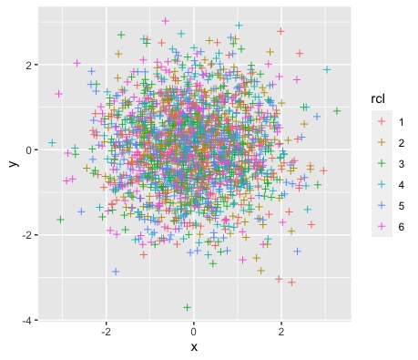

# Generate the data

Let's generate 2000 random points with normal distribution. In order to simulate clusters in the random data, I will shift the value of each point to one of 6 attractors (the variable `rcl`).

```{r}
set.seed(0)
d <- data.frame(x=(rnorm(n = 2000)), 
                y=rnorm(n=2000), 
                rcl=factor(sample(1:6, 2000, replace=TRUE)))
knitr::kable(head(d))
```

|          x |          y | rcl |
|-----------:|-----------:|:----|
|  1.2629543 |  0.4443458 | 3   |
| -0.3262334 |  0.0119294 | 6   |
|  1.3297993 | -0.0092800 | 1   |
|  1.2724293 | -0.3023776 | 2   |
|  0.4146414 |  0.4923550 | 6   |
| -1.5399500 | -0.6027196 | 5   |

This is how the randomly generated data looks like:

```{r}
library(ggplot2)
ggplot2::ggplot(data=d, aes(x=x, y=y, col=rcl)) + 
  geom_point(shape=3)
```

## 

## Artificially structure the data into clusters

The attractors are 6 points randomly assigned to x and y coordinates:

```{r}
rp <- data.frame(x.c=abs(rnorm(1:6, sd=4)), 
                 y.c=abs(rnorm(6, sd=4)), 
                 rcl=factor(sample(1:6, replace=FALSE)))
ggplot(data=rp, aes(x=x.c, y=y.c, col=rcl)) + 
  geom_point(shape=3)
```


So we can just artificially structure the data around these attractors by dragging random points closer to one of them:

```{r}
library(dplyr)
dc <- d %>%
  left_join(rp, by="rcl") %>%
  mutate(x.n=x+(x.c),
         y.n=y+(y.c)) %>%
  dplyr::select(rcl, x.n, y.n)
ggplot(data=dc, aes(x=x.n, y=y.n, col=rcl)) + 
  geom_point(shape=3)
```


if we remove the colour label, the data looks very much like clustered data that you may obtain from an eye-tracking experiment:

```{r}
ggplot(data=dc, aes(x=x.n, y=y.n)) + 
  geom_point(shape=3) + 
  labs(title="??") + 
  theme(plot.title = element_text(hjust = 0.5))
```


## Clusters in the data

We often find clusters in eye-tracking data because they reflect the areas that people prefer to look at, for example in a picture. Preferred areas - often termed *areas of interest* - are determined by visual salience but also the participant's own interests, experiences and background.

```{r}
library(grid)
image <- jpeg::readJPEG("Henry_Meynell_Rheam_-_Sleeping_Beauty copy.jpg")
ggplot(data=dc, aes(x=x.n, y=y.n)) + 
  labs(title="??") + 
  theme(plot.title = element_text(hjust = 0.5)) + 
  annotation_custom(rasterGrob(image, width = unit(1,"npc"), height = unit(1,"npc")), -Inf, Inf, -Inf, Inf) + 
  geom_point(shape=3) + 
  coord_fixed()
```


Clustering methods will allow to estimate a number of clusters that are present in the data; in the case of eye-tracking data, they may correspond to areas of interest.

# K-means Clustering Method

K-means is an unsupervised clustering method. It uses an algorithm that creates clusters with minimum internal variance, measured as the within-cluster sum of squares.

The algorithm repeats itself and assigns each data point to the cluster whose mean has the least squared (*nearest*) mean, and calculates the mean of the updated cluster (termed *centroid*). The algorithm converges and quits when the allocation of data points does not change anymore when updating the cluster mean. To apply this algorithm, it is necessary to set a predefined number of clusters.

## The Elbow Test

To estimate the best number of clusters to feed to the K-mean algorithm, the elbow test calculates a measure of the error estimate (the *sum of squared error*) for a predefined number of clusters (for example, up to 10). Since increasing the clusters to infinite reduces the sum of squared error to 0, we are looking for the number of clusters that gives the minimum SSE before saturation.

```{r}
# Determine number of clusters
dc.b <- dc[,-1]
dc.b
wss <- (nrow(dc.b)-1)*sum(apply(dc.b,2,var))

for (i in 2:10) wss[i] <- sum(kmeans(dc.b, 
   centers=i)$withinss)

ggplot(data=data.frame(Clusters=as.factor(10:1),
                       SEE=sort(wss, decreasing = FALSE),
                       group=1),
       aes(x=Clusters, y=SEE, group=group)) +
  geom_point() +
  geom_line()
```


The *elbow* of the test corresponds to the node where the sum of squared error starts to plateau - here from 4 clusters on - meaning that, when we subdivide the data in more than 3 clusters, we do not gain anymore in terms of error. Therefore, we are going to select 3 clusters for the next steps. You may notice that *this number does not reflect the initial number of attractors that we seeded in the data*.

```{r}
# K-Means Cluster Analysis
fit <- kmeans(dc.b, 3) # 3 cluster solution
# get cluster means 
knitr::kable(aggregate(dc.b,by=list(fit$cluster),FUN=mean))
```

| Group.1 |      x.n |      y.n |
|--------:|---------:|---------:|
|       1 | 1.676188 | 4.819651 |
|       2 | 2.081512 | 2.226081 |
|       3 | 6.733131 | 2.996920 |

```{r}
# append cluster assignment
cl.d <- data.frame(dc.b, fit$cluster)
knitr::kable(head(cl.d))
```

|      x.n |      y.n | fit.cluster |
|---------:|---------:|------------:|
| 1.718316 | 3.612103 |           1 |
| 2.981136 | 1.606597 |           2 |
| 3.104668 | 3.483643 |           2 |
| 2.317243 | 4.709362 |           1 |
| 3.722011 | 2.087022 |           2 |
| 5.560002 | 2.377491 |           3 |

The algorithm assigned each of the data points to 1 of the 3 clusters that they are more likely to pertain to.

```{r}
ggplot(data=cl.d, aes(x=x.n, y=y.n, col=as.factor(fit.cluster))) + 
labs(title="K-means", col="Cluster") + 
  theme(plot.title = element_text(hjust = 0.5)) + 
  annotation_custom(rasterGrob(image, width = unit(1,"npc"), height = unit(1,"npc")), -Inf, Inf, -Inf, Inf) + 
  geom_point(shape=3) + 
  coord_fixed() 
```


Again, note that the clusters found in the data with this algorithm do not correspond to the initial subdivision that we know to be true - because we artificially instilled it in the data.

# K-Medoids

Using a different method will give even more different clusters?

The method *Partitioning around Medoids* selects a *k* number of medoids or cluster centers - very similar to the attractors that we artificially created at the beginning.

The data points are assigned to closest cluster, and the sum of the distance of a data point from the medoid or cluster center is calculated. The operation is repeated by swapping which medoids each point is assigned to, calculating a new sum of distance and subtracting it from the previous distance estimate. If the obtained difference is \> 0, the swap is reverted. The algorithm converges when all the differences equal to 0. For this method, there is no need to predefine the number of clusters - althought the function will take a little more time to run compareed to K-means.

We obtain yet different data points to each cluster.

```{r}
library(fpc)
library(cluster)
pamk.best <- pamk(dc.b)
med <- pamk.best$pamobject$medoids
cl.pam <- data.frame(dc.b, pam.cluster=pamk.best$pamobject$clustering)
knitr::kable(head(cl.pam))
```

|      x.n |      y.n | pam.cluster |
|---------:|---------:|------------:|
| 1.718316 | 3.612103 |           1 |
| 2.981136 | 1.606597 |           1 |
| 3.104668 | 3.483643 |           1 |
| 2.317243 | 4.709362 |           1 |
| 3.722011 | 2.087022 |           1 |
| 5.560002 | 2.377491 |           2 |

```{r}
ggplot(data=cl.pam, aes(x=x.n, y=y.n)) + 
  labs(title="Partitioning Around Medoids",
       col="Cluster",
       caption="X = Medoid") + 
  theme(plot.title = element_text(hjust = 0.5)) + 
  annotation_custom(rasterGrob(image, width = unit(1,"npc"), height = unit(1,"npc")), -Inf, Inf, -Inf, Inf) + 
  geom_point(shape=3, aes(col=as.factor(pam.cluster))) + 
  coord_fixed() +
  geom_point(data=as.data.frame(med), 
  aes(x=x.n, y=y.n), shape="X", col="red", size=4) +
  theme(plot.caption = element_text(hjust = 0.5, colour = "red"))
```


This time, we even obtain 2 clusters, centered around their own medoid (each marked with a X).

# Mean Shift Clustering

This method places a weight (termed *kernel*) to each data point to built a probability distribution. The distribution will change depending on the bandwidth chosen to smooth the surface of the probability distribution.

The algorithm shifts the data points onto the closest peak of the probability distribution, until no point can be shifted any more.

The first step to apply this method is to reduce the points to the same scale, for example by their standard deviation.

```{r}
library(MASS)

# scale data by sd
sd <- cbind(x.n=sd(dc.b$x.n), y.n=sd(dc.b$y.n))

sc.d <- dc.b/sd

#calculate kernel
z <- kde2d(sc.d$x.n, sc.d$y.n)

#plot kernel map
pic <- ggplot(sc.d, aes(x=x.n, y=y.n)) +
  annotation_custom(rasterGrob(image, width = unit(1,"npc"), height = unit(1,"npc")), -Inf, Inf, -Inf, Inf) + 
  stat_density2d(aes(fill=..level..), geom="polygon", 
                 alpha=0.5, h=c(0.3, 0.3)) +
  stat_density2d(aes(col=..level..), h=c(0.3, 0.3)) +
  scale_fill_gradient2(low="skyblue2", high="firebrick1", 
                       midpoint=mean(range(z$z))) +
  scale_color_continuous(low="skyblue2", high="firebrick1") +
  coord_fixed() +
  labs(y="") +
  guides(color=FALSE)

points <- ggplot() +
  geom_point(data=sc.d, aes(x=x.n, y=y.n),
    shape=21, size=2, col="black", 
    fill="gray", alpha=0.8, size=2) + 
  stat_density2d(data=sc.d, aes(x=x.n, y=y.n, fill=..level..), geom="polygon", 
                 alpha=0.5, h=c(0.3, 0.3)) +
  stat_density2d(data=sc.d, aes(x=x.n, y=y.n, col=..level..), 
                 h=c(0.3, 0.3)) + #bandwidth
  scale_fill_gradient2(low="skyblue2", high="firebrick1", 
                       midpoint=mean(range(z$z))) +
  scale_color_continuous(low="skyblue2", high="firebrick1") +
  coord_fixed() +
  labs(y="") +
  guides(color=FALSE)
  

library(ggpubr)
twop1 <- ggarrange(pic, points, ncol = 2, common.legend = TRUE, legend = "right")
twop1 <- annotate_figure(twop1,
               top = text_grob("Multivariate kernel density estimation"),
               bottom = text_grob("Scaling: SD \n Bandwidth: 0.3",
                                  hjust = 1),
               left = text_grob("y.n", rot = 90))
# ggsave(plot = twop1, filename = "twop1-2.pdf")
twop1
```


The plots show the level of density across the whole distribution. We can use the density distribution to cluster the data. The algorithm finds 3 clusters:

```{r}
# install.packages("LPCM")
library(LPCM)
set.seed(88)
cl.ms <- ms(as.matrix(sc.d), scaled=0, h=0.3) 
plot(cl.ms)
```


Centred around 3 coordinates in the density distribution:

```{r}
knitr::kable(cl.ms$cluster.center)
```

|         x |        y |
|----------:|---------:|
| 0.8943363 | 1.927752 |
| 2.7723615 | 1.237859 |
| 4.2952553 | 1.918252 |

Since we are talking of density distribution, the cluster centers correspond to the *modes*, the most frequent values taken by x and y:

```{r}
x <- cbind(cl.ms$cluster.center[,1])
rownames(x) <- NULL
y <- cbind(cl.ms$cluster.center[,2])
rownames(y) <- NULL
cc <- cbind(1:nrow(x))
coo <- as.data.frame(cbind(x,y,cc))
colnames(coo) <- c("x.n", "y.n", "cc")

modes <- points + geom_point(aes(x=x.n, 
                                 y=y.n, 
                                 shape=as.factor(cc)), 
                             data=coo,
                             fill="blue", size=4) + 
  labs(col="Shift Cluster") + 
  scale_shape_manual(values = c(21,22,23,24)) +
  labs(shape="Cluster Center")
modes
```


```{r}
sc.d$shift.cluster <- cl.ms$cluster.label
sc.d.1 <- subset(sc.d, shift.cluster==1)
sc.d.2 <- subset(sc.d, shift.cluster==2)
sc.d.3 <- subset(sc.d, shift.cluster==3)
sc.d.4 <- subset(sc.d, shift.cluster==4)
# sc.d.5 <- subset(sc.d, shift.cluster==5)
# sc.d.6 <- subset(sc.d, shift.cluster==6)
# sc.d.7 <- subset(sc.d, shift.cluster==7)

library(ggalt)
cl <- ggplot(data=sc.d, aes(x=x.n, y=y.n)) + 
  labs(y="") + 
  annotation_custom(rasterGrob(image, width = unit(1,"npc"), 
                               height = unit(1,"npc")), -Inf, Inf, 
                    -Inf, Inf) + 
  geom_point(shape=3) + 
  coord_fixed() +  
  labs(shape="Cluster Center") +
  geom_point(aes(x=x.n, y=y.n, shape=as.factor(cc)), 
             fill="blue", data=coo, size=4) + 
  geom_encircle(data = sc.d.1, col="red", linetype="twodash") + 
  geom_encircle(data = sc.d.2, col="red", linetype="longdash") + 
  geom_encircle(data = sc.d.3, col="red", linetype="dotdash") + 
  geom_encircle(data = sc.d.4, col="red", linetype="solid") 

twop2 <- annotate_figure(cl,
               top = text_grob("Mean Shift Clustering"),
               bottom = text_grob("Scaling: SD \n Bandwidth: 0.3",
                                  hjust = 1),
               left = text_grob("y.n", rot = 90))
twop2
```


Differently from the other two solutions, this clustering does not display a *sharp* demarcation between the areas, but provides a certain degree of overlap. This mimics more efficiently the *real* situation of our data, where the areas of attraction of the artificial points did overlap.

Despite the fact that it seems more adept to the real data, this solution may present a less general solution, for example for application to external datasets. Being *anatomically* fitted on some data distribution, may detect clusters that are not transferable.

# Conclusions

The overall conclusions of this demonstrations are:

-   Cluster are not real. They are the best estimate based on algorithms that tend to minimise error, and do not necessarily overlap with subtending processes

-   When there is no information on the processes that may have clustered the data, hence the researcher does not possess an expectation in terms of how many clusters are present in the data, it is a good idea to compare different clustering methods

-   If you have a big enough dataset, save a *test* set to validate the cluster solution

-   Cluster solutions that *fit the data like a glove* are often weighted by increased *variance* that makes them less reliable if the purpose is to replicate on external dataset. This is often the case with eye-tracking datasets - we want to find areas of interest that we can use across studies. So be careful!
