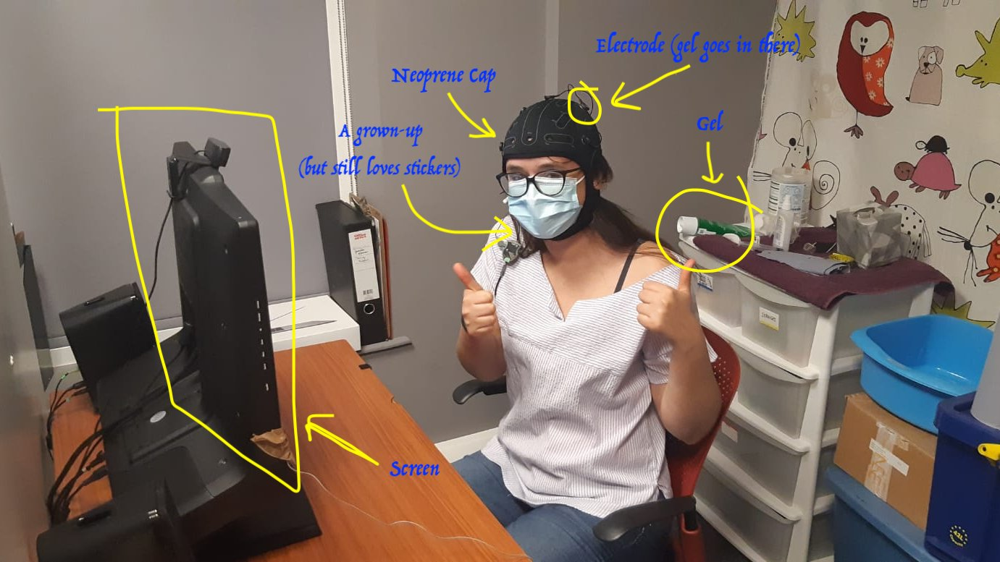

In my job, I have to sit down children, put a neoprene cap on their
head, fill 20-30 electrodes with squishy gel and have them watch some
stuff on a screen while I record the brain activity.

Does it sound... impossible? Testing with children sounds daunting to
many. But there is good news: children are actually sentient beings that
can be engaged and involved in the task! Or, be interested in something
else. Here is a walk through of my essential tips for testing with
children (the short version).

**Observe the child and act**

As a general rule, the most important thing is to distract the child and
act quickly if they are calm, minimising their focus towards you and the
equipment. To distract the child, you can have a video or cartoon
playing on a screen or give them something to play with.

**Casually introducing the cap**

More nervous children might benefit from progressively introducing the
cap and the gel to them: for example, you might start a cartoon on the
screen, and have the cap on the table so that they can see it in their
peripheral view. While the cartoon is playing, start to get the cap
closer, manipulate it, wear it yourself so that the children understand
what it is. Do that without talking, as if you are watching the cartoon
and casually taking the cap in your hands. The child will have the
chance to observe the cap in their own time, without pressure and, most
importantly, without focus on the cap.

**Never say cold!**

Some children might be a little sensitive to the gel, mostly because it
is cold at first (then it warms up in contact with the skin. So, it is a
good idea to warn them, so that they are not surprised by the sensation.
I used to say they'll feel 'cold' on the head, but apparently the word
'cold' is a little scary to children, and I had a child once that
literally started to rattle his teeth as he had real cold chills all
over. So nowadays, I warn them that they'll feel 'tiny little fresh
drops' or something like that.

If they are still bothered by the gel, putting a tiny bit on their
finger usually makes the trick because it is slimy and green and they
generally love that.

**Reward**

Promising and receiving a sticker at the end of the capping is very
rewarding. This varies a bit by country, but in the UK, children will
literally do anything you ask for a sticker. The more stickers they
receive, the more they will want to bring home.

**Older children, from 8 years old on**

With this age, you can actually explain to them what you are going to
do, and why.

Some children are into science because they hear about it at school (or,
if not science, science fiction), so you can explain to them that the
brain responds to what we see and hears in different ways that are very
unique, and that it is something that makes us 'human'. And that we can
actually record it!

But, in order to achieve that, they need to do their part, and try to be
still, and look at the screen, even if it is boring, because the brain
response is tiny - it's not like a lightning or a thunder.

If they are curious, you can promise them that you will show their brain
activity on the laptop screen at the end. You can make them blink, talk
and shallow and show how their brain signal changes.

**Playing with the perception of time**

If the child is not very compliant during the tasks, you can try to
downplay the length and make them feel good.

You can say things like 'it's only a couple of minutes more' or 'it has
not been 10 minutes yet, not tired already?', and praise them 'you have
been so good! best participant ever, go on like that!', and always ask
them to look at the screen as many times as you need.

Don't feel guilty about that, EEG experiment for children are not that
long really - usually up to a maximum of 30 minutes.

**Breaks**

If they are restless, they can have a break. Explain to them that they
should try to be still, calm and focused during the task, but they can
relax and have a small break in between. Knowing that they don't have to
keep continued attention for long but regular breaks are included
usually helps them manage their attention. You can promise/offer a small
gift for making it through to the break. Just keep in mind that rewards
and stickers need to be age appropriate, like pre-teens will like video
game characters better than dinosaurs.

Just don't let them see all the stickers that you have or they will want
all of them.
