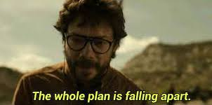

Some years ago, I was a PhD Student and observing one of my best friend's struggles to progress in their career. After two rounds of a 1 year postdoc contract, they applied for postdoc jobs and interviewed multiple times for projects they would have been a good fit for but got rejected.

The main problem was their CV: not enough first-author publications.

During an interview with a Professor, they recounted their experience with several methods, and he asked:

> "Where is the proof?"

They showed him their CV. When the Professor looked at the list of their publications in search of the proof, he raised his gaze and asked them:

There is a problem in academia (although I am sure it is not limited to academia): 95% of the things that we do, does not count towards our CV and achievements. And any endevour that does not get published count as almost nothing. But that's not the specific topic I want to discuss here.

I want to try to answer to that Professor's question: *How is it possible?*

## The Golden Age: the Mythical First Period of Scientific Publishing

**I think there must have been a legendary golden time of scientific publishing when people were publishing a lot, and fast**.

People who started their career in the 90s or even in the 80s do not talk about that a lot - so I do not have factual information. But, I often have encountered senior researchers that push and hurry and easily spit surrealistic numbers of papers one should get published yearly. Five, seven, nine, eleven!

To be competitive and progress from postdoc to lecturer/fellow, one should have at least *more publications than you have*. So I assume, they must base these expectations on some golden age that has come and gone.

Publication is not fast today. At least, not for me and for everybody else that I know. I have been a postdoc since 2018. I published two papers - one is only in press now. But even if people that worked during the golden age are now a demographic minority, the standards of funders and institutions often still reflect these expectations. And even if you do not meet a Professor that asks the question - you start to ask yourself: ***How is it possible?***

To partly answer to that question, I can tell about my first postdoc publication (that you can read [here](https://www.sciencedirect.com/science/article/pii/S2451902220302561)).

## November 2018: The Analysis

**I started analyzing the data that then built my first postdoc paper in the winter of 2018,** maybe one month after I started my first contract after completing my PhD and a short period in the private sector. This was a secondary data analysis of a big cohort assembled years before. I was not around at that time, so to actually get to analyse the data I had to figure out a lot of stuff about the study, asking, discussing, negotiating and waiting on people - a process that took at least the whole winter.

**After I was all set, I re-run the analysis entirely with major changes at least 3 times** - once because I learnt a method that I thought was a better fit for the data (spring of 2019), a second time because of an error (summer 2019), and a last time because I dropped some of it and went for another direction (autumn 2019). How did this take so long? That I would analyse data was implicit to my role, but not actually included in my contract: I was paid to set up, coordinate and follow up multiple studies that were just starting and far from providing analysis and publication material - and that of course had to take priority.

## November 2019: The Draft

**I completed the first draft in the winter of 2019**, about a year after I started the analysis, and send it to the co-authors. Since this was a consortium paper, the co-authors who contributed to the study were numerous, multidisciplinary and with differing levels of seniority. I remember receiving extensive comments, some of them suggesting structural revision and rewriting, but my approach was to provide stronger justification of the main structure and concede on reformatting and additions. So it only took a couple of months.

## Spring 2020: The Reviews

**On the 3rd of March 2020, I submitted the draft to a journal.** In mid-May, we received four peer-reviews.

Peer-review is an anonymous feedback from an expert in the field invited by the journal's editor to advice whether the paper is fit for publication or not - for free. Peer-review was instituted after lots of influential papers were criticised or even retracted because they could not be replicated - known as the Replication Crisis - that, I believe, was the end of the legendary golden era that nobody talks about.

In academia, everyone peer-reviews: it is, by many, considered free labour, but its principle is that it is mutual favour.

**Two of the reviews that the paper received were good**: reviewer one was enthusiastic - he had even signed his feedback to reveal his identity. Reviewer three was okay - short, concise, with a bit of constructive advise, but certainly positive.

**Reviewer two - the feared reviewer two - provided one of those that I call apocalyptic feedback**. They found that the analytic approach was *problematic*, even *worrying*, and criticised it profoundly with pages of comments. Their criticism was mostly due to the fact they did not fully understand the analysis (sorry). Plus, they inferred that, since I was advertising a method that was novel, I was also implying that any other method that had been used before was rubbish. Their methods included, I suppose. Not surprisingly, reviewer two's tone was harsh, and the frustration of having to comment on our draft transpired unfiltered.

**Reviewer four - that the editor had probably sought to try to decide what to do given the stark contrast between reviewers one and three and reviewer two - was tepid**, did not comment on anything positive, but also expressed some criticism. Therefore, the editor decided to *reject* - however, given that the peer-review had ended in a draw, proposed to transfer the draft with the attached reviews to another journal of the same publisher, but less prestigious.

**We accepted: now the task was to address *all* of the reviewers' concerns.** I worked on the responses to the reviewers for about a month. Implementing as many comments as possible is the easiest way of having the reviewers and the editor accept your revision. That basically means that you re-write most of your paper, and you provide a point-by-point response to all of the comments, with reference to the page and line where you implemented the change. Of course, I could not implement some of reviewer two's comments without dumping my own work, so I wrote paragraphs - pages - to justify the analytic approach and explaining it more clearly and deeply. As I said to my supervisor, I basically wrote a second paper.

## Summer 2020: the Revisions

**I submitted my revisions on June 18, 2020, and received a second round of reviews in August.** All the reviewers were impressed and appeased by my responses, except reviewer two: they said I had provided too much chatter, and not implemented anything practical to prove my points.

**So that's what I did: I did a bunch of new analysis**. I took five or six new variables, wrote new scripts and run as many models, formatted as many tables and dedicated as many paragraphs. The Supplementary Materials that contained all of that became a 30 pages pdf with 5 sections each with 3-5 subsections full of stats and technicalities, and a bibliography (for reference, the paper was 20 pages). Basically, a third, and longer, paper. I think the reader can concede some poetic license here - with the new revision I *boiled* the editor and reviewer two.

## Autumn 2020: the Publication

**The paper was accepted on September 1, 2020, 2 years after I started the analysis, and when my first postdoc contract was about to expire**. It was the only first-author paper that I published during that period.

During those two years, I did a bunch of other stuff - collecting EEG data and setting up a multi-site study across 4 different countries, teaching and... oh, yes, the global pandemic happened.

This is not to brag or complain. I am an ordinary person and average academic. Every experience is unique and I do not intend to represent anything or anyone. A lot of what happened in the story above is pure chance. **So** **this timeline is just to answer the Professor's question:**

> How is it possible?

In case you are wondering, the meme theme of this post is the Professor from Money Heist/La Casa de Papel!
